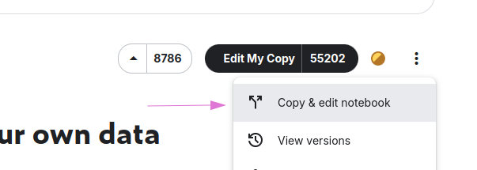
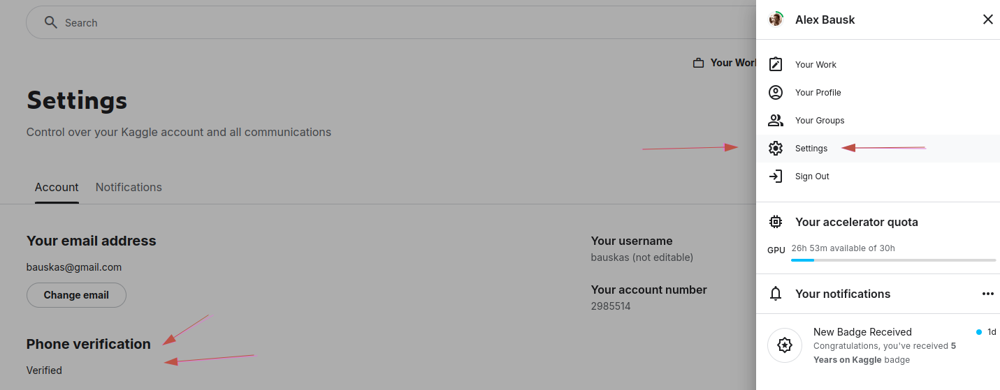
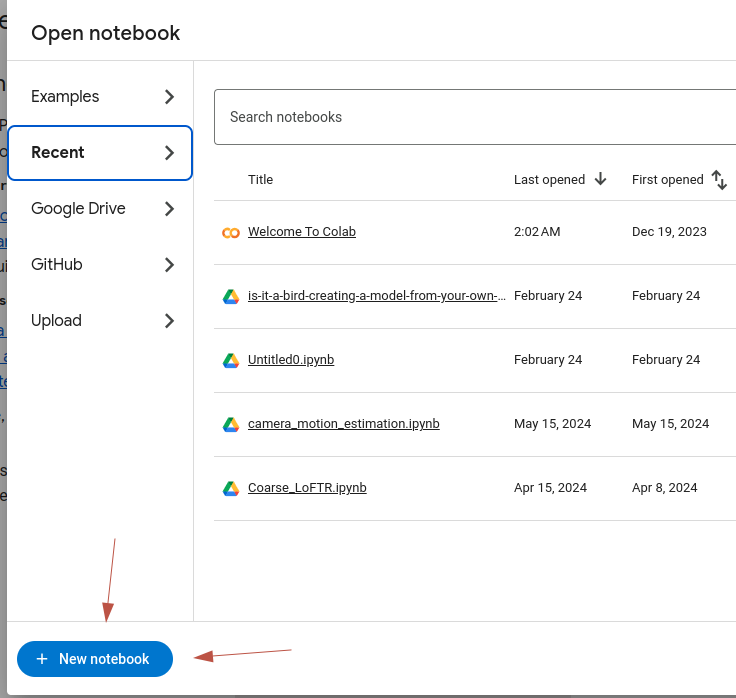

<div style="text-align: center;">

МІНІСТЕРСТВО ОСВІТИ І НАУКИ УКРАЇНИ

НАЦІОНАЛЬНИЙ УНІВЕРСИТЕТ "ЛЬВІВСЬКА ПОЛІТЕХНІКА"

</div>

<br/>
<br/>
<br/>
<br/>

# <div style="text-align: center;">СТВОРЕННЯ ТА НАВЧАННЯ МОДЕЛІ КОМП'ЮТЕРНОГО ЗОРУ ДЛЯ КЛАСИФІКАЦІЇ ЗОБРАЖЕНЬ</div>

<br/>
<br/>

## <div style="text-align: center;">МЕТОДИЧНІ ВКАЗІВКИ</div>
### <div style="text-align: center;">до виконання лабораторної роботи № 1 <br/> з дисципліни «Штучний інтелект в ігрових застосунках» <br/> для студентів бакалаврського рівня вищої освіти спеціальності 121 "Інженерія програмного забезпечення"</div>

<br/>
<br/>
<br/>
<br/>
<br/>
<br/>
<br/>
<br/>
<br/>
<br/>
<br/>
<br/>
<br/>
<br/>

### <p style="text-align: center;">Львів -- 2025</p>

<div style="page-break-after: always;"></div>

**Створення та навчання моделі комп'ютерного зору для класифікації зображень**: методичні вказівки до виконання лабораторної роботи №2 з дисципліни "Штучний інтелект" для студентів першого (бакалаврського) рівня вищої освіти спеціальності 121 "Інженерія програмного забезпечення" . Укл.: О.Є. Бауск. -- Львів: Видавництво Національного університету "Львівська політехніка", 2025. -- 10 с.

<br/>
<br/>
<br/>
<br/>

&nbsp;&nbsp;&nbsp;&nbsp;&nbsp;&nbsp;**Укладач**: Бауск О.Є., к.т.н., асистент кафедри ПЗ

<br/>
<br/>

&nbsp;&nbsp;&nbsp;&nbsp;&nbsp;&nbsp;**Відповідальний за випуск**: Федасюк Д.В., доктор техн. наук, професор

<br/>
<br/>

&nbsp;&nbsp;&nbsp;&nbsp;&nbsp;&nbsp;**Рецензенти**: Федасюк Д.В., доктор техн. наук, професор

&nbsp;&nbsp;&nbsp;&nbsp;&nbsp;&nbsp;&nbsp;&nbsp;&nbsp;&nbsp;&nbsp;&nbsp;&nbsp;&nbsp;&nbsp;&nbsp;&nbsp;&nbsp;&nbsp;&nbsp;&nbsp;&nbsp;&nbsp;&nbsp;&nbsp;&nbsp;&nbsp;&nbsp;&nbsp;&nbsp; Задорожний І.М., асистент кафедри ПЗ

<div style="page-break-after: always;"></div>

**Тема роботи**: Створення та навчання моделі глибокого навчання для класифікації зображень з використанням PyTorch, Kaggle, Jupyter Notebook та FastAI.

**Мета роботи**: Ознайомитись з основами глибокого навчання, навчитися створювати набори даних для навчання моделей комп'ютерного зору, використовувати бібліотеку fastai для навчання моделей класифікації зображень, та розгортати навчені моделі.

## <div style="text-align: center;">Теоретичні відомості</div>

### Вступ до машинного навчання

Машинне навчання - це революційний підхід, що дозволяє комп'ютерам виконувати завдання, не будучи явно запрограмованими для цього. Замість того, щоб вказувати кожен крок, ми надаємо комп'ютеру дані, з яких він може навчитися. Це підхід, що робить можливим розпізнавання об'єктів на зображеннях, розуміння тексту, прогнозування фінансових ринків та багато іншого.

На відміну від традиційного програмування, де розробник визначає кожен крок алгоритму, машинне навчання дозволяє системі самостійно знаходити закономірності в даних. Це досягається шляхом навчання моделей на основі прикладів, що дозволяє їм робити передбачення або приймати рішення.

### Глибоке навчання та його застосування

Глибоке навчання є підгалуззю машинного навчання, що використовує багатошарові нейронні мережі для обробки даних. Ці мережі здатні автоматично вивчати ієрархічні представлення даних, що робить їх надзвичайно потужними для вирішення складних задач.

Глибоке навчання застосовується в багатьох сферах, включаючи обробку природної мови, комп'ютерний зір, медицину, біологію, генерацію зображень, рекомендаційні системи та навіть в іграх. Наприклад, у медицині алгоритми глибокого навчання можуть виявляти аномалії на рентгенівських знімках з точністю, що перевищує можливості людських радіологів.

### Історія нейронних мереж

Історія нейронних мереж починається з 1943 року, коли Воррен МакКаллок та Волтер Піттс розробили математичну модель штучного нейрона. Вони показали, що нейронні події можуть бути описані за допомогою логіки, що стало основою для подальшого розвитку нейронних мереж.

У 1950-х роках Френк Розенблатт розробив перцептрон, перший пристрій, здатний навчатися розпізнавати прості форми. Хоча перцептрон мав обмеження, його розвиток заклав основу для сучасних багатошарових нейронних мереж, які сьогодні використовуються для вирішення складних задач.

### Сучасні інструменти для глибокого навчання

Сьогодні для глибокого навчання використовуються потужні інструменти, такі як PyTorch та fastai. PyTorch є гнучкою та виразною бібліотекою, що дозволяє створювати моделі глибокого навчання з високою швидкістю та простотою. Fastai, побудована на основі PyTorch, надає високорівневі інструменти для швидкого створення моделей, що робить глибоке навчання доступним для широкого кола користувачів.

### Практичні аспекти роботи з Jupyter Notebook

Jupyter Notebook - це інтерактивне середовище, яке дозволяє поєднувати код, текст, візуалізації та інші медіа в одному документі. Це ідеальний інструмент для експериментів з моделями машинного навчання, оскільки він дозволяє швидко змінювати та тестувати код.

Щоб почати роботу з Jupyter Notebook, необхідно встановити його за допомогою команди `pip install jupyter` та запустити за допомогою `jupyter notebook`. Це відкриє веб-інтерфейс, де ви зможете створювати та редагувати ноутбуки.

В контексті даної лабораторної роботи, Jupyter Notebook буде використовуватися для створення та навчання моделей глибокого навчання, але ми будемо використовувати Kaggle для цього.

Kaggle - це онлайн-платформа для машинного навчання, яка надає доступ до великого набору даних та моделей. Вона також включає в себе Jupyter Notebook, що дозволяє нам створювати та навчати моделі глибокого навчання. Таким чином, ми можемо використовувати Jupyter Notebook для створення та навчання моделей глибокого навчання, не встановлюючи його на своєму комп'ютері, і взагалі не встановлювати нічого на локальній машині.

### Створення першої моделі

Навчання моделі починається з підготовки даних. Наприклад, для класифікації зображень ми можемо використовувати набір даних з фотографіями котів та собак. Використовуючи бібліотеку fastai, ми можемо швидко створити модель, яка навчиться розпізнавати ці зображення.

Процес навчання включає кілька етапів: підготовка даних, створення моделі, навчання та оцінка якості. Fastai спрощує цей процес, надаючи інструменти для автоматичної обробки даних, налаштування моделі та моніторингу навчання.

### Використання попередньо навчених моделей

Однією з ключових переваг глибокого навчання є можливість використання попередньо навчених моделей, що дозволяє значно скоротити час навчання та покращити якість результатів. Цей підхід, відомий як передавальне навчання, дозволяє адаптувати модель до нових задач, використовуючи вже наявні знання.

### Глибоке навчання та комп'ютерний зір

Глибоке навчання - це підрозділ машинного навчання, що базується на штучних нейронних мережах з багатьма шарами. Ці мережі здатні автоматично вивчати представлення даних з багатьма рівнями абстракції.

У контексті комп'ютерного зору, глибокі нейронні мережі показали надзвичайну ефективність у вирішенні задач:
- Класифікації зображень
- Виявлення об'єктів
- Сегментації зображень
- Генерації зображень

### Бібліотека fastai

fastai - це бібліотека глибокого навчання високого рівня, побудована на основі PyTorch. Вона надає готові інструменти та найкращі практики для швидкого створення високоякісних моделей глибокого навчання.

Основні переваги fastai:
1. Простий API високого рівня
2. Вбудовані найкращі практики
3. Готові рішення для типових задач
4. Інтеграція з PyTorch для низькорівневого контролю

### Процес створення моделі класифікації

Типовий процес створення моделі класифікації зображень включає наступні кроки:

1. **Підготовка даних**
   - Збір зображень
   - Розділення на навчальну та валідаційну вибірки
   - Аугментація даних

2. **Створення моделі**
   - Вибір архітектури
   - Налаштування гіперпараметрів
   - Підготовка функції втрат та метрик

3. **Навчання**
   - Підбір швидкості навчання
   - Навчання моделі
   - Моніторинг процесу навчання

4. **Оцінка та покращення**
   - Аналіз помилок
   - Тонке налаштування
   - Валідація на тестових даних

5. **Розгортання**
   - Експорт моделі
   - Створення інтерфейсу
   - Розгортання на платформі

### Технічні вимоги

1. **Для розробки:**
   - Python 3.9+
   - Jupyter Notebook
   - Kaggle акаунт
   - fastai бібліотека
   - PyTorch

2. **Для розгортання:**
   - Hugging Face акаунт
   - Git
   - Gradio

### Висновок

Глибоке навчання - це потужний інструмент, що відкриває нові можливості в багатьох сферах. Завдяки сучасним бібліотекам та інструментам, таким як PyTorch, fastai та Jupyter Notebook, цей підхід стає доступним для широкого кола користувачів, дозволяючи їм створювати моделі, що здатні вирішувати складні задачі з високою точністю.

## <div style="text-align: center;">Хід роботи</div>

### 1. Налаштування середовища розробки

1.1. Створити акаунт на Kaggle: [https://www.kaggle.com/](https://www.kaggle.com/)

1.2. Відкрити Jupyter notebook "Is it a Bird?" в Kaggle: [https://www.kaggle.com/code/bauskas/creating-an-image-classifier](https://www.kaggle.com/code/bauskas/creating-an-image-classifier)

1.3. Створити копію notebook для власної роботи:



1.4 Перевірити наступне:

- згідно з інструкціями у коді, вам необхідно верифікувати акаунт через телефон в Kaggle. Зайдіть на головну сторінку вашого акаунта в Kaggle, клікніть на кнопку профіля в правому верхньому куті, клікніть Settings і переконайтеся, що у вас є верифікований телефон (див. скріншот нижче). Якщо телефон не верифікований, то його потрібно верифікувати.



**УВАГА!** Якщо телефон неможливо верифікувати, використовуйте аналогічній Kaggle сервіс Google Collab: [https://colab.research.google.com/](https://colab.research.google.com/). Вам необхідно використовувати будь-який власний акаунт Google, щоб мати можливість зайти в Google Collab.




Почніть новий ноутбук в Google Collab і просто копіюйте код послідовно з кожної ячейки вашого ноутбука Kaggle в Google Collab.

Замість наступної інструкції у другій ячейці:

```python
if iskaggle:
    !pip install -Uqq fastai 'duckduckgo_search>=6.2'
```

використовуйте наступну інструкцію без перевірки `if`:

```python
!pip install -Uqq fastai 'duckduckgo_search>=6.2'
```

- У вашої копії завдання має бути увімкнений доступ до інтернету. Стан перемикача в Settings має бути як на скріншоті нижче. Якщо він вимкнений, то його потрібно увімкнути.


- У вас надійний доступ до інтернету. Він необхідний для роботи з DuckDuckGo API і іншими сервісами, що використовуються в коді.


### 2. Підготовка набору даних

Виконайте всі ячейки коду в ноутбуку, щоб імплементувати класифікатор зображень.

Проаналізуйте коментарі до коду і сам код, щоб зрозуміти, що відбувається на кожному з наступних кроків.

2.1. Встановити необхідні бібліотеки інструкцією `!pip install -Uqq fastai 'duckduckgo_search>=6.2'`.

2.1. Використати DuckDuckGo API для завантаження зображень.

2.2. Завантажити зображення для двох класів:
- Птахи
- Ліс (фонові зображення)

2.3. Перевірити якість завантажених зображень та видалити пошкоджені файли.

### 3. Створення та навчання моделі

3.1. Cтворити блок даних для навчання моделі (тренувальний та валідаційний набори).

3.2. Створити модель використовуючи архітектуру ResNet.

3.3. Навчити модель на тренувальному наборі.

3.4. Виконати процедуру fine-tuning.

### 4. Використання моделі

4.1. Використати модель для класифікації раніше завантажених зображень `bird.jpg` та `forest.jpg`.

### 5. Побудова власної моделі для інших класів зображень

5.1. Тепер вам необхідно вибрати варіант класів зображень, які ви будете класифікувати, з варіантів наведених нижче в методичці, або по бажанню придумати власні.

Уважно проаналізуйте всі ячейки коду в ноутбуці спочатку, щоб зрозуміти, які зміни необхідно зробити для створення власного класифікатора. Треба змінити пошукові запити до DuckDuckGo API, а також змінити назви змінних, назви файлів, що ви завантажуєте (наприклад, `bird.jpg` та `forest.jpg`), і таке інше.

5.2. Виконайте всі зміни в коді, щоб створити власний класифікатор.

5.3. Натренувайте модель на власному наборі даних.

5.4. Використайте модель для класифікації власних зображень.

## <div style="text-align: center;">УМОВА ЗАВДАННЯ ДО ЛАБОРАТОРНОЇ РОБОТИ</div>

1. Налаштувати середовище розробки в Kaggle.

2. Створити набір даних для класифікації зображень з двох класів.

3. Створити модель-класифікатор.

4. Натренувати та використати модель для класифікації зображень.

5. Побудувати власний класифікатор для інших класів зображень.

## <div style="text-align: center;">ІНДІВІДУАЛЬНІ ВАРІАНТИ ЗАВДАННЯ</div>

Кожен студент має створити класифікатор для однієї з наступних пар класів:

1. Кішки vs Собаки
2. Автомобілі vs Мотоцикли
3. Квіти vs Дерева
4. Портрети vs Пейзажі
5. Будівлі vs Природа
6. Фрукти vs Овочі
7. Літаки vs Кораблі
8. День vs Ніч
9. Місто vs Село
10. Гори vs Море
11. Їжа vs Напої
12. Комахи vs Птахи
13. Спорт vs Музика
14. Зима vs Літо
15. Дощ vs Сонце
16. Книги vs Журнали
17. Настільні ігри vs Відеоігри
18. Кава vs Чай
19. Риба vs М'ясо
20. Макіяж vs Косметика
21. Годинники vs Ювелірні вироби
22. Окуляри vs Контактні лінзи
23. Рукописний текст vs Друкований текст
24. Малюнки vs Фотографії
25. Скульптури vs Картини

## <div style="text-align: center;">ЗМІСТ ЗВІТУ</div>

1. Тема та мета роботи
2. Теоретичні відомості
3. Постановка завдання
4. Хід виконання роботи:
   - Скріншоти процесу створення набору даних
   - Код та пояснення для створення моделі
   - Графіки або скріншоти процесу навчання
   - Скріншоти інтерфейсу
5. Результати роботи
6. Висновки

## <div style="text-align: center;">КОНТРОЛЬНІ ПИТАННЯ</div>

1. Що таке глибоке навчання і як воно відрізняється від традиційного машинного навчання?

2. Які основні компоненти необхідні для створення моделі класифікації зображень?

3. Що таке fine-tuning і коли його варто застосовувати?

4. Які переваги використання fastai порівняно з чистим PyTorch?

6. Як правильно підготувати набір даних для навчання моделі?

8. Як оцінити якість роботи моделі класифікації?

9. Які основні проблеми можуть виникнути при навчанні моделі?

10. Як можна покращити точність моделі?

11. Що таке learning rate і як правильно його підібрати?

12. Що ви знаєте про ResNet?

13. Які існують методи регуляризації в глибокому навчанні?

14. Як правильно розділити дані на навчальну та валідаційну вибірки?

15. Що таке overfitting і як його уникнути?

16. Як можна уникнути помилок при впровадженні ШІ в організації?

17. Поясніть, що відбувається в процесі навчання моделі?

18. Поясніть в подробицях, що відбувається, якщо відкрити файл Jupyter Notebook в Kaggle, записати в ячейку код "1+1" і натиснути "Run".

## <div style="text-align: center;">СПИСОК ЛІТЕРАТУРИ</div>

1. Howard J., Gugger S. Deep Learning for Coders with fastai and PyTorch. -- O'Reilly Media, 2020.

2. Fast.ai Course v5 [Електронний ресурс]. -- Режим доступу: https://course.fast.ai/

3. PyTorch Documentation [Електронний ресурс]. -- Режим доступу: https://pytorch.org/docs/stable/index.html

4. fastai Documentation [Електронний ресурс]. -- Режим доступу: https://docs.fast.ai/

5. Chollet F. Deep Learning with Python. -- Manning Publications, 2021.

6. Gradio Documentation [Електронний ресурс]. -- Режим доступу: https://gradio.app/docs/

7. Hugging Face Documentation [Електронний ресурс]. -- Режим доступу: https://huggingface.co/docs

8. He K. et al. Deep Residual Learning for Image Recognition // IEEE Conference on Computer Vision and Pattern Recognition (CVPR). -- 2016.

9. Is It a Bird? [Електронний ресурс]. -- Режим доступу: https://www.kaggle.com/code/jhoward/is-it-a-bird-creating-a-model-from-your-own-data

10. DuckDuckGo API [Електронний ресурс]. -- Режим доступу: https://duckduckgo.com/api

11. Stanford CS229 Lecture Notes [Електронний ресурс]. -- Режим доступу: https://cs229.stanford.edu/lectures-spring2022/main_notes.pdf

12. Coursera Machine Learning Specialization [Електронний ресурс]. -- Режим доступу: https://www.coursera.org/specializations/machine-learning-introduction

13. Stanford CS229 Cheatsheet [Електронний ресурс]. -- Режим доступу: https://stanford.edu/~shervine/teaching/cs-229/cheatsheet-supervised-learning

14. Fastbook [Електронний ресурс]. -- Режим доступу: https://github.com/fastai/fastbook/blob/master/01_intro.ipynb
