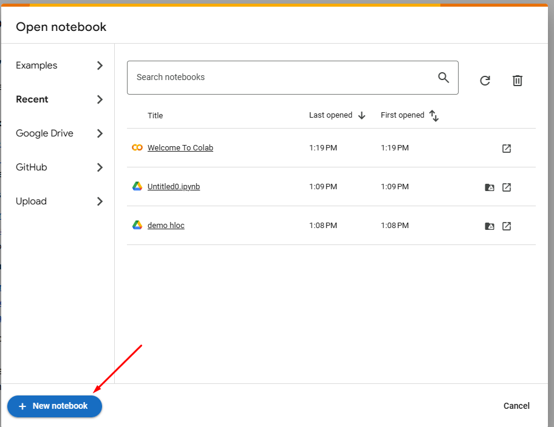
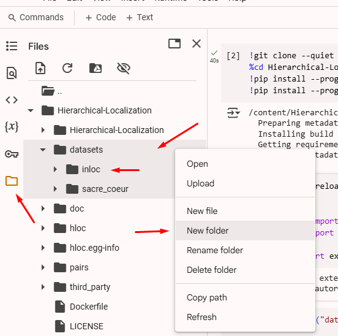
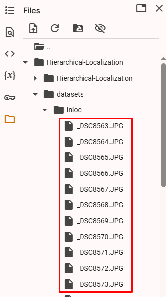
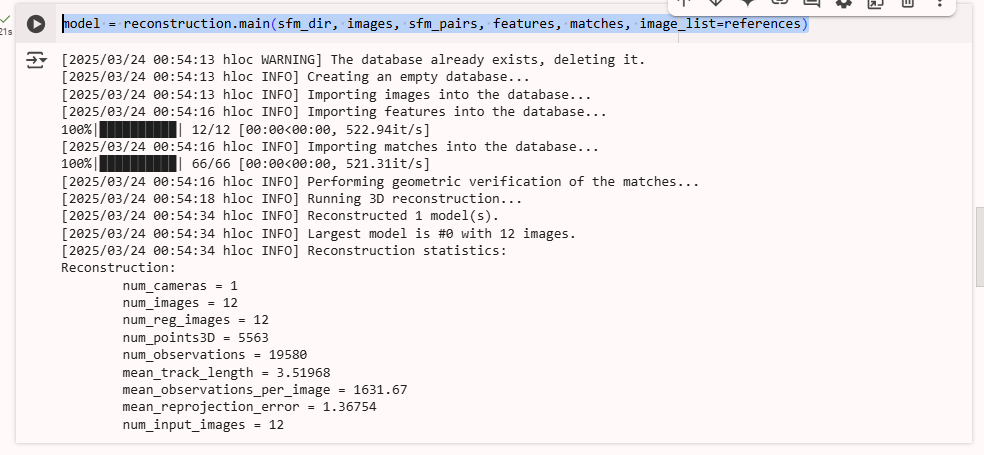
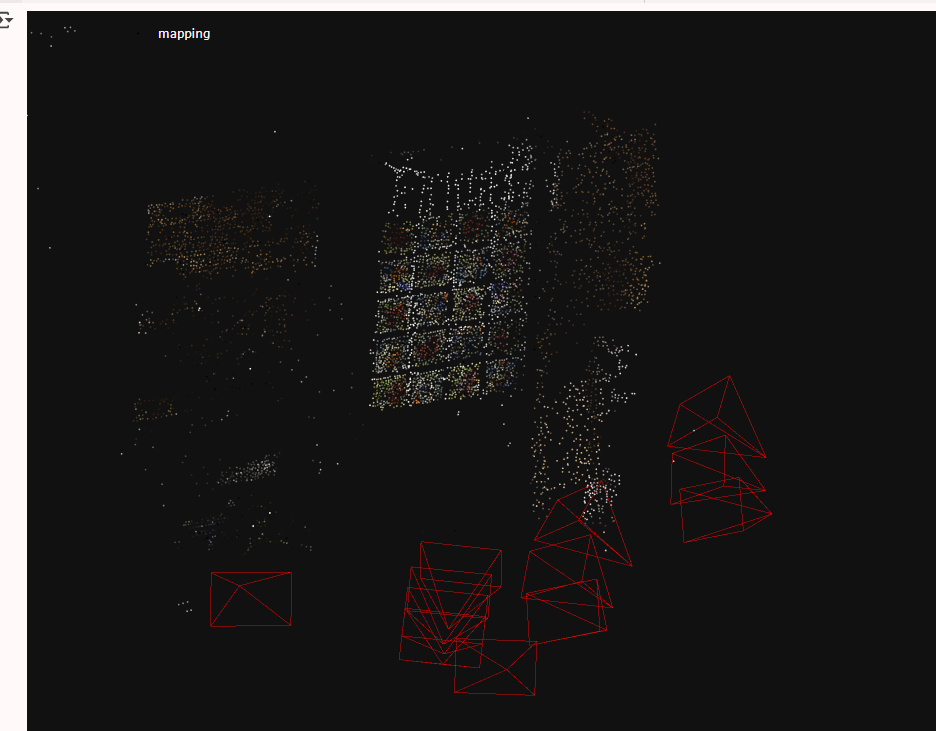
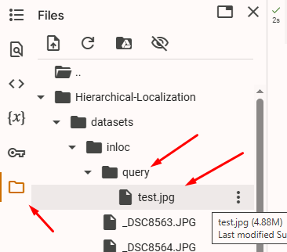
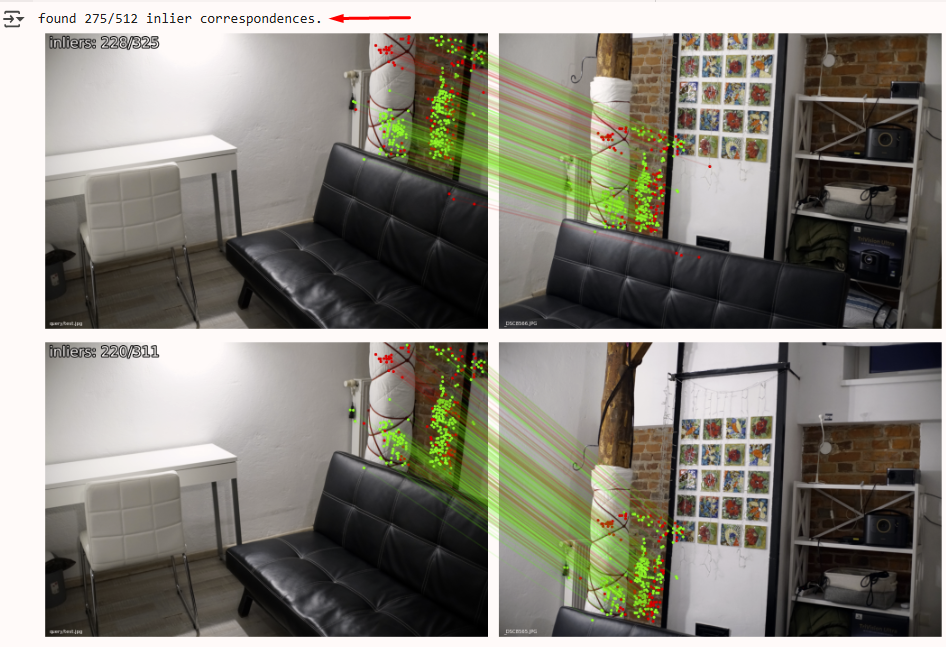
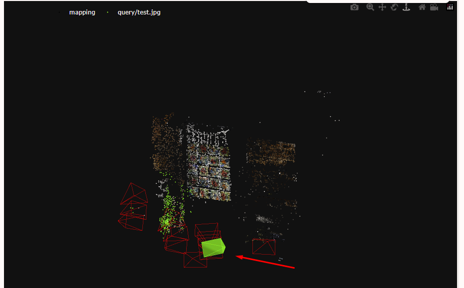

<div style="text-align: center;">

МІНІСТЕРСТВО ОСВІТИ І НАУКИ УКРАЇНИ

НАЦІОНАЛЬНИЙ УНІВЕРСИТЕТ "ЛЬВІВСЬКА ПОЛІТЕХНІКА"

</div>

<br/>
<br/>
<br/>
<br/>

# <div style="text-align: center;">ВИРІШЕННЯ ЗАДАЧІ STRUCTURE FROM MOTION ЗА ДОПОМОГОЮ АЛГОРИТМУ HLOC</div>

<br/>
<br/>

## <div style="text-align: center;">МЕТОДИЧНІ ВКАЗІВКИ</div>
### <div style="text-align: center;">до виконання лабораторної роботи № 4 <br/> з дисципліни «Штучний інтелект в ігрових застосунках» <br/> для студентів бакалаврського рівня вищої освіти спеціальності 121 "Інженерія програмного забезпечення"</div>

<br/>
<br/>
<br/>
<br/>
<br/>
<br/>
<br/>
<br/>
<br/>
<br/>
<br/>
<br/>
<br/>
<br/>

### <p style="text-align: center;">Львів -- 2025</p>

<div style="page-break-after: always;"></div>

**Вирішення задачі Structure from Motion за допомогою алгоритму HLOC**: методичні вказівки до виконання лабораторної роботи №4 з дисципліни "Штучний інтелект в ігрових застосунках" для студентів першого (бакалаврського) рівня вищої освіти спеціальності 121 "Інженерія програмного забезпечення" . Укл.: О.Є. Бауск. -- Львів: Видавництво Національного університету "Львівська політехніка", 2025. -- 10 с.

<br/>
<br/>
<br/>
<br/>

&nbsp;&nbsp;&nbsp;&nbsp;&nbsp;&nbsp;**Укладач**: Бауск О.Є., к.т.н., асистент кафедри ПЗ

<br/>
<br/>

&nbsp;&nbsp;&nbsp;&nbsp;&nbsp;&nbsp;**Відповідальний за випуск**: Федасюк Д.В., доктор техн. наук, професор

<br/>
<br/>

&nbsp;&nbsp;&nbsp;&nbsp;&nbsp;&nbsp;**Рецензенти**: Федасюк Д.В., доктор техн. наук, професор

&nbsp;&nbsp;&nbsp;&nbsp;&nbsp;&nbsp;&nbsp;&nbsp;&nbsp;&nbsp;&nbsp;&nbsp;&nbsp;&nbsp;&nbsp;&nbsp;&nbsp;&nbsp;&nbsp;&nbsp;&nbsp;&nbsp;&nbsp;&nbsp;&nbsp;&nbsp;&nbsp;&nbsp;&nbsp;&nbsp; Задорожний І.М., асистент кафедри ПЗ

<div style="page-break-after: always;"></div>

**Тема роботи**: Вирішення задачі Structure from Motion за допомогою алгоритму HLOC.

**Мета роботи**: Ознайомитись з роботою і можливостями ШІ алгоритмів побудування хмари точок з неструктурованих зображень для умов приміщень та архітектурних об'єктів, ознайомитись з вирішенням задачі Structure-from-Motion (StM) та локализації камери.

## <div style="text-align: center;">Теоретичні відомості</div>

### Що таке Structure from Motion (SfM)?

Structure from Motion (SfM) — це техніка комп'ютерного зору, яка дозволяє відтворити 3D-структуру об'єкта або сцени з набору 2D-зображень, знятих з різних ракурсів. На відміну від стереозору, який вимагає калібровані камери, SfM може працювати з неструктурованими наборами зображень, автоматично визначаючи як 3D-координати точок сцени, так і позиції камер.

Основні етапи SfM включають:
1. Виявлення особливих точок на зображеннях
2. Співставлення цих точок між різними зображеннями
3. Оцінка відносних позицій камер
4. Тріангуляція 3D-точок
5. Оптимізація (bundle adjustment)

### Проблеми візуальної локалізації

Візуальна локалізація — це задача визначення точної 6-DoF (шість ступенів свободи) позиції камери відносно відомої 3D-моделі на основі єдиного зображення. Ця технологія критично важлива для:
- Автономного водіння
- Мобільної робототехніки
- Доповненої реальності
- Навігації в приміщеннях

Незважаючи на важливість, візуальна локалізація залишається складною задачею, особливо в умовах:
- Великих середовищ (міського масштабу)
- Значних змін освітлення (день/ніч)
- Сезонних змін (літо/зима)
- Архітектурних модифікацій

### Ієрархічна локалізація (Hierarchical Localization)

Hierarchical Localization (HLOC) — це ефективний підхід до вирішення задачі візуальної локалізації, розроблений дослідниками з Computer Vision Group. HLOC використовує стратегію "від грубого до точного" (coarse-to-fine), що дозволяє ефективно локалізувати камеру в великомасштабних середовищах, навіть за наявності складних умов.

Основна ідея підходу полягає в розділенні процесу локалізації на ієрархічні етапи:

1. **Глобальний пошук** (Global Matching):
   - Використання глобальних дескрипторів зображень для пошуку найбільш схожих зображень з бази даних
   - Це дозволяє швидко звузити можливі місця розташування до кількох кандидатів

2. **Локальне співставлення** (Local Matching):
   - Використання локальних особливостей (keypoints і дескриптори) для точного співставлення між запитом і кандидатами
   - Встановлення відповідностей між 2D-точками запиту та 3D-точками моделі

3. **Оцінка 6-DoF пози** (Pose Estimation):
   - Використання алгоритму PnP (Perspective-n-Point) з RANSAC для обчислення точної пози камери
   - Геометрична верифікація для відкидання помилкових співставлень

Цей ієрархічний підхід має кілька ключових переваг:
- Значно покращує обчислювальну ефективність, уникаючи вичерпного пошуку по всій моделі
- Підвищує надійність локалізації в складних умовах
- Дозволяє застосовувати різні типи ознак на різних рівнях ієрархії

### HLOC: бібліотека для ієрархічної локалізації

HLOC — це бібліотека з відкритим кодом, яка реалізує парадигму ієрархічної локалізації. Вона об'єднує найсучасніші методи виявлення та опису локальних особливостей, глобального опису зображень та геометричної верифікації в єдиний ефективний конвеєр.

Основні компоненти HLOC:

1. **Глобальні дескриптори**:
   - NetVLAD: мережева архітектура для агрегації локальних ознак у глобальні дескриптори
   - DenseVLAD: адаптація NetVLAD для роботи з щільними ознаками
   - OpenIBL, CosPlace: сучасні архітектури для глобального опису зображень

2. **Локальні особливості**:
   - SuperPoint: CNN-архітектура для виявлення та опису локальних особливостей
   - SIFT: класичний метод виявлення та опису локальних особливостей
   - R2D2, DISK, D2Net: сучасні методи виявлення та опису особливостей

3. **Матчери локальних особливостей**:
   - SuperGlue: алгоритм на основі графових нейронних мереж для встановлення відповідностей
   - NN-matching: співставлення на основі найближчих сусідів
   - AdaLAM, LightGlue: ефективні алгоритми співставлення

HLOC також включає готові конвеєри (pipelines) для різних наборів даних, таких як Aachen Day-Night, InLoc, Cambridge Landmarks та інші.

### Переваги використання навчених особливостей

Сучасні підходи до візуальної локалізації все частіше використовують особливості, отримані за допомогою глибокого навчання, замість традиційних ручно розроблених методів, таких як SIFT. Це дає кілька важливих переваг:

1. **Вища стійкість до змін умов**:
   - Навчені дескриптори (наприклад, SuperPoint) демонструють вищу інваріантність до змін освітлення, погоди та сезонів
   - Це критично важливо для надійної локалізації в реальних умовах

2. **Кращі показники відтворюваності**:
   - Детектори на основі CNN виявляють ключові точки з вищою відтворюваністю між зображеннями
   - Це призводить до більшої кількості коректних співставлень

3. **Ефективність**:
   - Навчені методи часто генерують менше, але більш інформативні особливості
   - Це зменшує обчислювальні витрати на етапі співставлення

4. **Вища точність локалізації**:
   - Поєднання навчених глобальних і локальних особливостей дозволяє досягти вищої точності позиціонування
   - Навчені методи показують значно кращі результати в складних умовах (наприклад, нічний час)

### Продуктивність та застосування

HLOC демонструє вражаючі результати на стандартних наборах даних для візуальної локалізації:

- На Aachen Day-Night v1.0, метод SuperPoint + SuperGlue з NetVLAD досягає точності 86.7% для денних запитів та 75.2% для нічних запитів
- Ієрархічний підхід значно перевершує традиційні методи в складних умовах, особливо для нічних запитів

Практичні застосування HLOC включають:
- Автономну навігацію в складних міських середовищах
- Системи доповненої реальності з прецизійним позиціонуванням
- Картографування та реконструкцію великих територій
- Локалізацію в приміщеннях, де GPS недоступний

### Структура 3D-моделі

Для візуальної локалізації та SfM, HLOC використовує розріджену 3D-модель, яка містить:
- 3D-точки з відповідними дескрипторами
- Камери з відомими позиціями та параметрами
- Інформацію про видимість (які точки видно з яких камер)

Ця модель зазвичай будується за допомогою COLMAP — програмного забезпечення для SfM, яке автоматично реконструює 3D-сцену з набору зображень.

### Висновок

Ієрархічна локалізація та бібліотека HLOC представляють сучасний підхід до вирішення задачі візуальної локалізації, поєднуючи ефективність ієрархічного пошуку з надійністю навчених особливостей. Цей підхід особливо цінний для застосувань, які вимагають як високої точності, так і обчислювальної ефективності, і встановлює новий рівень продуктивності в складних умовах візуальної локалізації.

## <div style="text-align: center;">Хід роботи</div>

### 1. Загальні відомості про лабораторну роботу.

Кожен етап лабораторної роботи занотуйте скріншотами для звіту. Проаналізуйте наданий код і переконайтеся, що ви розумієте, що відбувається на кожному етапі.

В рамках лабораторної роботи ви реалізуєте процес HLOC для одного з двох датасетів/сценаріїв -- приміщення або архітектурний об'єкт.

В якості індивідуального завдання вам треба реалізувати варіант на основі власного датасету, тобто власного набору зображень, на основі яких нейронною мережею буде побудована 3D-модель шляхом детекції ключових точок, їхнього співставлення, та локалізації камери для кожного зображення. Оберіть варіант, який вам більше сприйнятний з точки зору приватності та який ви можете самостійно реалізувати. Нижче наведено рекомендації щодо підготовки датасету.

Після підготовки датасету ви можете приступити до виконання завдання, для чого вам потрібен акаунт Google, оскільки робота виконується в середовищі Google Collab з використанням Jupyter Notebook та мови програмування Python.

**УВАГА!** Пам'ятайте, що Google Collab є фронтендом для середовища виконання, яке запускається як тимчасове в хмарі. Це означає, що через якийсь час середовище виконання буде перезапущене -- тобто ваш **код буде збережений**, але запускати його, завантажувати фотографії датасета, виконувати процедуру встановлення залежностей, пошука пар зображень і так далі доведеться виконувати заново. Бажано запланувати свій час так, щоб зробити необхідні скріншоти роботи для звіту і т.д. за одну робочу сесію, або бути готовим запустити ячейки середовища заново.

Ми використовуємо Google Colab для виконання лабораторної роботи, оскільки це зручний інструмент, який дозволяє нам швидко розгорнути середовище виконання, яке буде максимально просто налаштувати незалежно від комп'ютера користувача. У випадку, якщо ви не хочете або не можете використовувати Google Colab або хочете попрактикуватись в самостійному розгортанні пайплайну штучного інтелекту локально, використайте інструкції з репозиторія HLOC для локального розгортання пайплайну в Docker: [HLOC Docker Install](https://github.com/cvg/Hierarchical-Localization/tree/master?tab=readme-ov-file#installation). Робити це **необов'язково** -- все необхідне для виконання лабораторної роботи можна зробити в Google Collab.

https://github.com/cvg/Hierarchical-Localization/tree/master?tab=readme-ov-file#installation

Власний датасет слід підготувати наступним чином. Оберіть **один з двох варіантів**:

- Для приміщення: зробіть 12-15 знімків приміщення (квартири, офісу, аудиторії, кав'ярні, галереї або іншого публічного місця, де дозволяється фотографувати) з різних точок зору. Важливо, щоб поле зору фотографій перекривалося між собою.

- Для архітектурного об'єкту: зробіть 15-20 знімків архітектурного об'єкту (будинку, споруди, природнього об'єкту) з різних точок зору. Не обов'язково фотографувати всі кути об'єкту, але важливо, щоб поле зору фотографій перекривалося між собою. Наприклад, може бути достатньо фотографувати один фасад і кілька характерних точок з інших точок зору. **УВАГА!** Ні в якому разі не використовуйте в якості предмету зйомки мости, об'єкти інфраструктури або військові об'єкти, оберіть звичайний будинок або відому пам'ятку архітектури. Подбайте про приватність та безпеку при підготовці датасету.

Всі зображення в обох випадках повинні бути в форматі `.jpg`. В обох випадках сформуйте датасет таким чином: всі знімки окрім одного формують датасет для побудови 3D-моделі, а один знімок використовується для локалізації камери по побудованій 3D-моделі. Цей знімок перейменуйте на `test.jpg`.

### 2. Підготовка середовища

2.1. Відкрийте новий Google Colab ноутбук:

[https://colab.research.google.com/](https://colab.research.google.com/)



Виконання ячейки ноутбука виконується натисканням на кнопку "▶" вгорі або клавішею `Ctrl+Enter`.

Наступну ячейку слід виконувати після завершення виконання попередньої.

Наступну ячейку можна створити натисканням на кнопку "+" вгорі або клавішею `Shift+Enter` (що також виконує активну ячейку).

Кожен новий пункт лабораторної роботи слід вводити в нову ячейку.

2.2. Клонування репозиторію HLOC:

В першу комірку Jupyter ноутбука введіть та виконайте наступний код.

```python
!git clone --quiet --recursive https://github.com/cvg/Hierarchical-Localization/
%cd /content/Hierarchical-Localization
!pip install --progress-bar off --quiet -e .
!pip install --progress-bar off --quiet --upgrade plotly
```

Дочекайтеся завершення виконання всіх команд, як на ілюстрації нижче.


2.3. Імпортування необхідних бібліотек:

```python
%load_ext autoreload
%autoreload 2

from pathlib import Path
from pprint import pformat

from hloc import extract_features, match_features, localize_inloc, visualization
```

### 3. Налаштування параметрів роботи

3.1. Визначення шляхів до директорій та файлів:

```python
dataset = Path("datasets/inloc/")  # В цю директорію будуть завантажені зображення для мапінгу

pairs = Path("pairs/inloc/")  # В цю директорію будуть завантажені пари зображень для мапінгу
loc_pairs = pairs / "pairs-sfm.txt"  # В цей файл будуть записані пари зображень для локалізації

outputs = Path("outputs/inloc/")  # В цю директорію будуть зберігатися результати роботи
results = outputs / "InLoc_hloc_superpoint+superglue_netvlad40.txt"  # В цей файл буде записаний результат
```

3.2. Завантаження зображень до середовища виконання:

Для завантаження зображень використовуйте панель інструментів Google Colab: 
- Перейдіть на вкладку "Файли" в лівому бічному меню
- Створіть директорію `datasets/inloc`
- Натисніть кнопку "Завантажити"
- Виберіть всі підготовлені зображення для мапінгу і завантажте їх у цю директорію



В результаті ви побачите приблизно такий результат:



### 4. Побудова 3D-карти сцени

4.1. Ознайомимось з доступними конфігураціями для отримання особливостей зображень і співставлення між ними. Пам'ятаємо, що це два основні і окремі процеси, які виконуються в рамках побудови 3D-моделі сцени -- спочатку від "сирих" вихідних даних у вигляді зображень нам треба перейти в простір особливостей, а потім відповідно до співставлених особливостей відбувається побудова 3D-моделі.

```python
print(f"Конфігурації для детекції особливостей:\n{pformat(extract_features.confs)}")
print(f"Конфігурації для співставлення особливостей:\n{pformat(match_features.confs)}")
```

Для нашого завдання ми будемо використовувати пре-треновану конволюційну нейронну мережу з використанням навчання з підкріпленням (Reinforcement Learning) методом градієнту стратегії (policy gradient) Disk для отримання особливостей і графову нейронну мережу (GNN) архітектури "трансформер" LightGlue для співставлення між парами зображень.

Для подальшого ознайомлення:

https://github.com/cvlab-epfl/disk

https://github.com/cvg/LightGlue

Результат роботи графової нейронної мережі LightGlue -- це пари точок, які відповідають одна одній на двох зображеннях.

4.2. Визначення шляхів до директорій та файлів і конфігурацій для виконання побудови 3D-моделі:

```python
%cd /content/Hierarchical-Localization
images = Path('datasets/inloc')
outputs = Path('outputs/inloc/')
!rm -rf $outputs
sfm_pairs = outputs / 'pairs-sfm.txt'
loc_pairs = outputs / 'pairs-loc.txt'
sfm_dir = outputs / 'sfm'
features = outputs / 'features.h5'
matches = outputs / 'matches.h5'

feature_conf = extract_features.confs['disk']
matcher_conf = match_features.confs['disk+lightglue']
```

4.3. Визначення списку зображень для мапінгу:

```python
from hloc import extract_features, match_features, reconstruction, visualization, pairs_from_exhaustive
from hloc.visualization import plot_images, read_image
from hloc.utils import viz_3d
references = [str(p.relative_to(images)) for p in (images).iterdir()]
print(len(references), "зображень для мапінгу")
plot_images([read_image(images / r) for r in references], dpi=25)
```

4.4. Вилучення особливостей та співставлення між парами зображень. Це ключовий етап побудови 3D-моделі, який визначає особливості зображень, знаходить пари зображень, які варто порівнювати, і співставляє їх.

В нашому випадку ми маємо дуже невеликий датасет, тому ми використовуємо метод грубого перебору (`pairs_from_exhaustive`) для визначення пар зображень, які варто порівнювати. Для великих датасетів можуть використовуватися більш швидкі, оптимізовані методи.

```python
extract_features.main(feature_conf, images, image_list=references, feature_path=features)
pairs_from_exhaustive.main(sfm_pairs, image_list=references)
match_features.main(matcher_conf, sfm_pairs, features=features, matches=matches)
```

Як бачимо, вилучення особливостей та співставлення між парами зображень займає досить тривалий час.

4.3. Запуск інкрементальної процедури Structure-from-Motion і побудування моделі:

```python
model = reconstruction.main(sfm_dir, images, sfm_pairs, features, matches, image_list=references)
```

Занотуйте у вашому звіті результати побудови 3D-моделі, а саме кількість камер, зображень і 3D-точок:



4.4. Візуалізація реконструйованої 3D-моделі:

```python
fig = viz_3d.init_figure()
viz_3d.plot_reconstruction(fig, model, color='rgba(255,0,0,0.5)', name="mapping", points_rgb=True)
fig.show()
```

Занотуйте у вашому звіті результати візуалізації реконструйованої 3D-моделі. Роздивіться візуально і занотуйте у звіті якість реконструкції за кількістю камер, зображень і 3D-точок. Чи результати реконструкції відповідають реальній сцені? Чи є явні артефакти і помилки в локалізації точок? Чи є очовидні причини помилок, такі як недостатня кількість зображень, недостатня якість зображень, недостатнє перекриття зображень між собою? Зробіть висновки і внесіть їх у звіт.



4.5. Візуалізація особливих точок, які були тріангульовані в 3D-модель, на парі зображень:

```python
visualization.visualize_sfm_2d(model, images, selected=[3,4], color_by='visibility', n=2)
```

4.6. Виправлення помилок при виконанні коду.

На цьому або наступних етапах ви можете зіткнутися з помилками, які виникають через несумісність з новими версіями бібліотеки `pycolmap`. У випадку помилки з `absolute_pose_estimation` або з `inliers` клікніть по файлу, в якому знаходиться помилка, і файл відкриється для редагування у боковій панелі. Вам треба буде відредагувати два файли: localize_sfm.py і visualization.py.

4.6.1. Виправлення помилки з `absolute_pose_estimation`: поміняйте назву метода на `estimate_and_refine_absolute_pose`

4.6.2. Виправлення помилки з `inliers`: поміняйте назву елементу результату `inliers` на `inlier_mask`.

4.7. В параметрі 'selected' в пункті 4.5. числа відповідають різним зображенням з вашого датасету. Поміняйте номери зображень на інші і порівняйте результати.

### 5. Локалізація зображення.

5.1. Перейдемо до вирішення задачі локалізації зображення. Для цього визначимо зображення для локалізації.

Завантажте ваше тестове зображення `test.jpg` для локалізації у директорію `query`, і візуалізуйте його.



```python
query = 'query/test.jpg'
plot_images([read_image(images / query)], dpi=75)
```

5.2. Вилучення особливостей для тестового зображення та їх співставлення з зображеннями з мапи:

```python
references_registered = [model.images[i].name for i in model.reg_image_ids()]
extract_features.main(feature_conf, images, image_list=[query], feature_path=features, overwrite=True)
pairs_from_exhaustive.main(loc_pairs, image_list=[query], ref_list=references_registered)
match_features.main(matcher_conf, loc_pairs, features=features, matches=matches, overwrite=True);
```

5.3. Визначення позиції камери за допомогою алгоритму RANSAC:

```python
import pycolmap
from hloc.localize_sfm import QueryLocalizer, pose_from_cluster

camera = pycolmap.infer_camera_from_image(images / query)
ref_ids = [model.find_image_with_name(n).image_id for n in references_registered]
conf = {
    'estimation': {'ransac': {'max_error': 12}},
    'refinement': {'refine_focal_length': True, 'refine_extra_params': True},
}
localizer = QueryLocalizer(model, conf)
ret, log = pose_from_cluster(localizer, query, camera, ref_ids, features, matches)

print(f'found {ret["num_inliers"]}/{len(ret["inlier_mask"])} inlier correspondences.')
visualization.visualize_loc_from_log(images, query, log, model)
```

Як було описано вище, виправте помилки, якщо вони є, і повторіть виконання коду цієї ячейки.

В результаті ви маєте отримати інформацію про кількість особливостей, які були знайдені на тестовому зображенні, і візуалізувати результати локалізації. Занотуйте у вашому звіті результати локалізації.



5.3. Оцінка і візуалізація позиції камери з тестового зображення, візуалізація позиції камери в 3D-моделі та 2D-3D відповідностей:

```python
pose = pycolmap.Image(cam_from_world=ret['cam_from_world'])
viz_3d.plot_camera_colmap(fig, pose, camera, color='rgba(0,255,0,0.5)', name=query, fill=True)
# visualize 2D-3D correspodences
import numpy as np
inl_3d = np.array([model.points3D[pid].xyz for pid in np.array(log['points3D_ids'])[ret['inlier_mask']]])
viz_3d.plot_points(fig, inl_3d, color="lime", ps=1, name=query)
fig.show()
```

Занотуйте у вашому звіті результати локалізації. На цьому етапі ви маєте отримати візуалізацію позиції камери з тестового зображення, знайдену шляхом використання Structure-from-Motion:



### 6. Експерименти та аналіз результатів

6.1. Спробуйте інші нейронні мережі для вилучення особливостей та співставлення особливостей.

Змініть конфігурацію з `'disk'` на інші доступні варіанти, наприклад:

```python
feature_conf = extract_features.confs['superpoint']
matcher_conf = match_features.confs['superpoint+lightglue']
```

(Після зміни конфігурації всі наступні ячейки треба виконати ще раз.)

Порівняйте результати з попередніми (кількість знайдених особливостей, суб'єктивна якість локалізації камери) і занотуйте у звіті.

### 7. Поради щодо вирішення проблем

7.1. Якщо процес реконструкції або локалізації завершується з помилкою:

- Перевірте якість та кількість зображень у датасеті
- Переконайтеся, що зображення мають достатнє перекриття між собою
- Спробуйте змінити параметри для вилучення особливостей (збільшіть `max_keypoints`)
- Спробуйте змінити параметри RANSAC (збільшіть `max_error`)

7.2. Якщо модель містить мало 3D-точок:

- Збільшіть кількість зображень у датасеті
- Переконайтеся, що зображення мають достатньо текстури та особливостей
- Змініть параметри для вилучення особливостей, щоб отримати більше точок

7.3. Якщо локалізація не вдається:

- Переконайтеся, що запитуване зображення містить частини сцени, присутні в моделі
- Спробуйте використати зображення, зняте з точки зору, близької до зображень для мапінгу
- Збільшіть параметр `max_error` для RANSAC

## <div style="text-align: center;">УМОВА ЗАВДАННЯ ДО ЛАБОРАТОРНОЇ РОБОТИ</div>

1. Підготувати датасет власних зображень приміщення або архітектурного об'єкту, як описано в розділі 1.

2. Реалізувати повний пайплайн з використанням HLOC для:
   - Вилучення особливостей з зображень
   - Співставлення особливостей між парами зображень
   - Побудови 3D-моделі за допомогою Structure-from-Motion
   - Локалізації запитуваного зображення в побудованій 3D-моделі

3. Експериментально дослідити вплив конфігурацій на якість реконструкції та локалізації:
   - Порівняти результати з використанням різних методів вилучення особливостей та співставлення


4. Проаналізувати отримані результати та зробити висновки про ефективність та обмеження методу HLOC для задач Structure-from-Motion та візуальної локалізації.

## <div style="text-align: center;">ІНДІВІДУАЛЬНІ ВАРІАНТИ ЗАВДАННЯ</div>

У якості індивідуального варіанту завдання виступає унікальний набір зображень, який кожен студент готує самостійно. Варіанти можливих сцен:

1. **Приміщення**: квартира, кімната, аудиторія, офіс, кав'ярня, магазин, галерея, музей тощо.
2. **Архітектурний об'єкт**: будинок, споруда, пам'ятник, фасад будівлі, скульптура, фонтан тощо.

## <div style="text-align: center;">ЗМІСТ ЗВІТУ</div>

1. Тема та мета роботи
2. Теоретичні відомості
3. Постановка завдання
4. Хід виконання роботи:
   - Опис підготовленого датасету з прикладами зображень
   - Скріншоти вилучених особливостей для різних методів
   - Скріншоти реконструйованої 3D-моделі
   - Скріншоти результатів локалізації запитуваного зображення
   - Результати порівняння різних конфігурацій методів вилучення та співставлення особливостей
5. Результати роботи та їх аналіз:
   - Порівняння результатів різних конфігурацій
   - Висновки про досліджений метод та його практичні застосування, можливості, обмеження.


## <div style="text-align: center;">КОНТРОЛЬНІ ПИТАННЯ</div>

1. Що таке Structure-from-Motion (SfM) і які основні етапи цього процесу?
2. Що таке ієрархічна локалізація?
3. Що таке особливості (features) і як вони використовуються в задачах машинного зору?
4. Які методи використовуються для співставлення особливостей між зображеннями?
5. Які фактори впливають на якість 3D-реконструкції в методі SfM?
6. Які переваги навчених особливостей порівняно з традиційними методами, такими як SIFT?
7. Які обмеження має метод HLOC і в яких умовах він може не працювати?
8. Які практичні застосування має технологія ієрархічної локалізації в сучасних системах?

## <div style="text-align: center;">СПИСОК ЛІТЕРАТУРИ</div>

1. Sarlin, P. E., Cadena, C., Siegwart, R., & Dymczyk, M. (2019). From Coarse to Fine: Robust Hierarchical Localization at Large Scale. In CVPR. https://github.com/cvg/Hierarchical-Localization/

2. Sarlin, P. E., DeTone, D., Malisiewicz, T., & Rabinovich, A. (2020). SuperGlue: Learning Feature Matching with Graph Neural Networks. In CVPR.

3. Schönberger, J. L., & Frahm, J. M. (2016). Structure-from-Motion Revisited. In CVPR.

4. DeTone, D., Malisiewicz, T., & Rabinovich, A. (2018). SuperPoint: Self-Supervised Interest Point Detection and Description. In CVPRW.

5. Lowe, D. G. (2004). Distinctive Image Features from Scale-Invariant Keypoints. International Journal of Computer Vision.

6. Bellavia, F., Mishkin, D., Barath, D., Matas, J., & Kat, T. (2023). LightGlue: Local Feature Matching at Light Speed. In ICCV.
