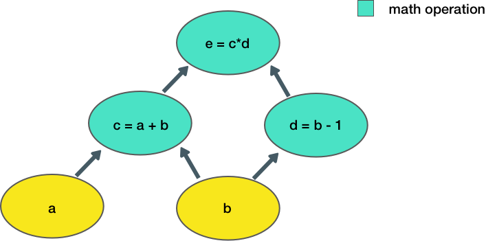
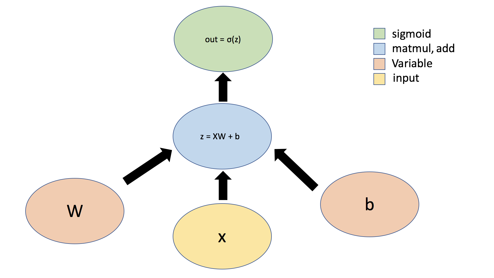
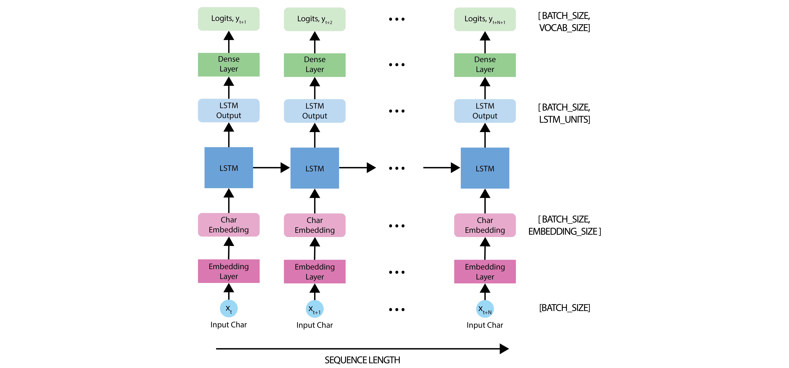

<div style="text-align: center;">

МІНІСТЕРСТВО ОСВІТИ І НАУКИ УКРАЇНИ

НАЦІОНАЛЬНИЙ УНІВЕРСИТЕТ "ЛЬВІВСЬКА ПОЛІТЕХНІКА"

</div>

<br/>
<br/>
<br/>
<br/>

# <div style="text-align: center;">ВСТУП ДО PYTORCH ТА ГЕНЕРАЦІЯ МУЗИКИ ЗА ДОПОМОГОЮ RNN</div>

<br/>
<br/>

## <div style="text-align: center;">МЕТОДИЧНІ ВКАЗІВКИ</div>
### <div style="text-align: center;">до виконання лабораторної роботи № 5 <br/> з дисципліни «Штучний інтелект в ігрових застосунках» <br/> для студентів бакалаврського рівня вищої освіти спеціальності 121 "Інженерія програмного забезпечення"</div>

<br/>
<br/>
<br/>
<br/>
<br/>
<br/>
<br/>
<br/>
<br/>
<br/>
<br/>
<br/>
<br/>

### <p style="text-align: center;">Львів -- 2025</p>

<div style="page-break-after: always;"></div>

**Вступ до PyTorch та генерація музики за допомогою RNN**: методичні вказівки до виконання лабораторної роботи №5 з дисципліни "Штучний інтелект в ігрових застосунках" для студентів першого (бакалаврського) рівня вищої освіти спеціальності 121 "Інженерія програмного забезпечення" . Укл.: О.Є. Бауск. -- Львів: Видавництво Національного університету "Львівська політехніка", 2025. -- 10 с.

<br/>
<br/>
<br/>
<br/>

&nbsp;&nbsp;&nbsp;&nbsp;&nbsp;&nbsp;**Укладач**: Бауск О.Є., к.т.н., асистент кафедри ПЗ

<br/>
<br/>

&nbsp;&nbsp;&nbsp;&nbsp;&nbsp;&nbsp;**Відповідальний за випуск**: Федасюк Д.В., доктор техн. наук, професор

<br/>
<br/>

&nbsp;&nbsp;&nbsp;&nbsp;&nbsp;&nbsp;**Рецензенти**: Федасюк Д.В., доктор техн. наук, професор

&nbsp;&nbsp;&nbsp;&nbsp;&nbsp;&nbsp;&nbsp;&nbsp;&nbsp;&nbsp;&nbsp;&nbsp;&nbsp;&nbsp;&nbsp;&nbsp;&nbsp;&nbsp;&nbsp;&nbsp;&nbsp;&nbsp;&nbsp;&nbsp;&nbsp;&nbsp;&nbsp;&nbsp;&nbsp;&nbsp; Задорожний І.М., асистент кафедри ПЗ

<div style="page-break-after: always;"></div>

**Тема роботи**: Вступ до PyTorch та генерація музики за допомогою рекурентних нейронних мереж (RNN).

**Мета роботи**: Ознайомитись з основами бібліотеки глибокого навчання PyTorch, навчитись визначати та тренувати прості нейронні мережі, а також застосувати рекурентні нейронні мережі для задачі генерації музики у форматі ABC notation.

## <div style="text-align: center;">Теоретичні відомості</div>

### Вступ до PyTorch

PyTorch — це популярна бібліотека глибокого навчання з відкритим кодом, відома своєю гнучкістю, простотою використання та динамічним графом обчислень. Вона широко використовується в дослідженнях та промисловості для створення та тренування нейронних мереж.

Основні концепції PyTorch:

1.  **Тензори (Tensors)**: Багатовимірні масиви, схожі на NumPy ndarrays, але з додатковою можливістю виконувати обчислення на GPU для прискорення. Тензори є основними будівельними блоками для даних у PyTorch.
2.  **Автоматичне диференціювання (Autograd)**: PyTorch автоматично обчислює градієнти для тензорів. Модуль `torch.autograd` відстежує операції над тензорами, дозволяючи легко реалізовувати зворотне поширення помилки для тренування мереж.
3.  **Модулі (`torch.nn.Module`)**: Клас `nn.Module` є базовим для всіх нейронних мереж у PyTorch. Він дозволяє інкапсулювати параметри моделі та операції в зручні об'єкти. Мережі можна будувати, комбінуючи існуючі модулі (шари) або створюючи власні.
4.  **Оптимізатори (`torch.optim`)**: Містить реалізації різноманітних алгоритмів оптимізації (наприклад, SGD, Adam), які використовуються для оновлення параметрів моделі під час тренування.
5.  **Функції втрат (`torch.nn`)**: Надає стандартні функції втрат (наприклад, CrossEntropyLoss, MSELoss), що використовуються для оцінки різниці між прогнозами моделі та реальними даними.

PyTorch дозволяє визначати моделі двома основними способами:
-   **`torch.nn.Sequential`**: Контейнер для послідовного з'єднання модулів. Зручний для простих мереж, де дані проходять через шари один за одним.
-   **Підкласи `torch.nn.Module`**: Більш гнучкий підхід, де користувач визначає власні класи, успадковуючи `nn.Module`. Це дозволяє створювати складні архітектури з розгалуженнями, пропусками з'єднань тощо.

### Рекурентні Нейронні Мережі (RNN)

Рекурентні нейронні мережі (RNN) — це клас нейронних мереж, спеціально розроблений для роботи з послідовними даними, такими як текст, часові ряди або музика. На відміну від стандартних мереж прямого поширення, RNN мають "пам'ять" завдяки наявності рекурентних (зворотних) зв'язків, які дозволяють інформації з попередніх кроків впливати на обчислення на поточних кроках.

Основна ідея RNN полягає в тому, що вихід мережі на кроці \(t\) залежить не тільки від входу на кроці \(t\), але й від прихованого стану мережі на кроці \(t-1\). Прихований стан \(h_t\) оновлюється на кожному кроці і слугує як зведена інформація про попередню історію послідовності.

\[ h_t = f(W_{hh} h_{t-1} + W_{xh} x_t + b_h) \]
\[ y_t = g(W_{hy} h_t + b_y) \]

де \(x_t\) — вхід на кроці \(t\), \(h_t\) — прихований стан, \(y_t\) — вихід, \(W\) — матриці ваг, \(b\) — вектори зміщень, а \(f\) та \(g\) — функції активації.

Існують більш складні варіанти RNN, такі як LSTM (Long Short-Term Memory) та GRU (Gated Recurrent Unit), які краще справляються з проблемою зникаючих/вибухаючих градієнтів і можуть ефективніше навчатись на довгих послідовностях.

### Генерація музики за допомогою RNN

RNN можна використовувати для генерації нової музики. Один з підходів — це "символьна RNN" (character RNN), де мережа навчається передбачати наступний символ у музичному записі, представленому у вигляді текстової послідовності.

**ABC Notation**: Це формат текстового запису музики, який використовує літери (A-G) для нот, цифри для тривалості, та інші символи для позначення ритму, тональності, тактів тощо. Наприклад:

```
X:1
T:The Legacy Jig
M:6/8
L:1/8
K:G
GFG GAB|cBc d2d|GFG GAB|cAF GFE|
GFG GAB|cBc dgf|ecA GcB|cAF GFE:|
```

**Процес генерації**:
1.  **Підготовка даних**: Музичний корпус у форматі ABC notation перетворюється на послідовність символів. Створюється словник унікальних символів.
2.  **Побудова моделі**: Створюється RNN (наприклад, LSTM), яка приймає на вхід послідовність символів і намагається передбачити наступний символ.
3.  **Тренування**: Модель тренується на великому корпусі музики, мінімізуючи функцію втрат (наприклад, перехресну ентропію) між передбаченими та реальними наступними символами.
4.  **Генерація (Sampling)**: Після тренування модель використовується для генерації нової музики. Починаючи з початкової послідовності ("seed"), модель ітеративно передбачає наступний символ, додає його до послідовності і використовує оновлену послідовність як вхід для наступного кроку. Ймовірнісний розподіл виходу мережі дозволяє вносити випадковість у процес генерації.

## <div style="text-align: center;">Хід роботи</div>

### 1. Загальні відомості про лабораторну роботу.

Лабораторна робота складається з двох частин, які виконуються за допомогою Jupyter Notebook у середовищі Google Colab.

*   **Частина 1: Вступ до PyTorch**: Ознайомлення з базовими операціями над тензорами, автоматичним диференціюванням та визначенням простих нейронних мереж.
*   **Частина 2: Генерація музики з RNN**: Побудова, тренування та використання RNN для генерації музики у форматі ABC notation.

Проаналізуйте наданий код у кожному ноутбуці та переконайтеся, що ви розумієте логіку виконання кожного кроку. Робіть скріншоти ключових етапів та результатів для звіту.

**УВАГА!** Пам'ятайте про обмеження Google Colab щодо часу роботи сесії та збереження даних. Завантажені файли та встановлені бібліотеки можуть зникнути після перезапуску середовища виконання. Плануйте свій час або будьте готові повторно виконати необхідні кроки.

### 2. Підготовка середовища Google Colab.

2.1. Відкрийте новий Google Colab ноутбук або використовуйте існуючий: [https://colab.research.google.com/](https://colab.research.google.com/)

2.2. Переконайтеся, що середовище виконання використовує GPU (Runtime -> Change runtime type -> Hardware accelerator -> GPU), якщо це необхідно для прискорення обчислень, хоча для цих завдань CPU може бути достатньо.

### 3. Частина 1: Вступ до PyTorch.

У цій частині ми ознайомимося з основами бібліотеки PyTorch та її можливостями для глибокого навчання.

#### 3.1. Що таке PyTorch?

PyTorch — це бібліотека машинного навчання, схожа на TensorFlow. У своїй основі PyTorch надає інтерфейс для створення та маніпулювання тензорами, які є структурами даних, що можна розглядати як багатовимірні масиви. Тензори представлені як n-вимірні масиви базових типів даних, таких як рядок або ціле число — вони забезпечують спосіб узагальнення векторів і матриць до вищих вимірів. PyTorch надає можливість виконувати обчислення на цих тензорах, визначати нейронні мережі та ефективно їх навчати.

`shape` тензора PyTorch визначає кількість його вимірів та розмір кожного виміру. `ndim` або `dim` тензора PyTorch надає кількість вимірів (n-вимірів) — це еквівалентно рангу тензора (як використовується в TensorFlow), і ви також можете розглядати це як порядок тензора.

Почнемо з створення декількох тензорів та вивчення їх властивостей:

```python
integer = torch.tensor(1234)
decimal = torch.tensor(3.14159265359)

print(f"`integer` is a {integer.ndim}-d Tensor: {integer}")
print(f"`decimal` is a {decimal.ndim}-d Tensor: {decimal}")
```

Вектори та списки можна використовувати для створення 1-вимірних тензорів:

```python
fibonacci = torch.tensor([1, 1, 2, 3, 5, 8])
count_to_100 = torch.tensor(range(100))

print(f"`fibonacci` is a {fibonacci.ndim}-d Tensor with shape: {fibonacci.shape}")
print(f"`count_to_100` is a {count_to_100.ndim}-d Tensor with shape: {count_to_100.shape}")
```

Створимо 2-вимірні тензори (матриці) та тензори вищих рангів. В обробці зображень та комп'ютерному зорі будемо використовувати 4-вимірні тензори з вимірами, що відповідають розміру батчу, кількості кольорових каналів, висоті та ширині зображення.

```python
# Створення 2-вимірного тензора (матриці)
matrix = torch.tensor([[1, 2, 3], [4, 5, 6]])

# Створення 4-вимірного тензора (10 RGB зображень розміром 256x256)
images = torch.zeros(10, 3, 256, 256)

print(f"matrix is a {matrix.ndim}-d Tensor with shape: {matrix.shape}")
print(f"images is a {images.ndim}-d Tensor with shape: {images.shape}")
```

#### 3.2. Обчислення на тензорах

Зручний спосіб думати про та візуалізувати обчислення в фреймворках машинного навчання, таких як PyTorch — це в термінах графів. Ми можемо визначити цей граф у термінах тензорів, які містять дані, та математичних операцій, які діють на ці тензори в певному порядку. Розглянемо простий приклад і визначимо це обчислення за допомогою PyTorch:


```python
# Створюємо вузли графа та ініціалізуємо значення
a = torch.tensor(15)
b = torch.tensor(61)

# Додаємо їх!
c1 = torch.add(a, b)
c2 = a + b  # PyTorch перевизначає операцію "+" для роботи з тензорами
print(f"c1: {c1}")
print(f"c2: {c2}")
```

Тепер розглянемо трохи складніший приклад:



Тут ми беремо два входи, `a, b`, і обчислюємо вихід `e`. Кожен вузол у графі представляє операцію, яка приймає деякий вхід, виконує деяке обчислення та передає свій вихід іншому вузлу.

```python
# Створення простої функції обчислення
def func(a, b):
    c = a + b
    d = b + 1
    e = c * d
    return e

# Приклад значень для a, b
a, b = 1.5, 2.5
# Виконання обчислення
e_out = func(a, b)
print(f"e_out: {e_out}")
```

#### 3.3. Нейронні мережі в PyTorch

Ми також можемо визначати нейронні мережі в PyTorch. PyTorch використовує `torch.nn.Module`, який служить базовим класом для всіх модулів нейронних мереж у PyTorch і, таким чином, забезпечує фреймворк для побудови та навчання нейронних мереж.

Розглянемо приклад простого перцептрона, визначеного лише одним щільним (повнозв'язаним або лінійним) шаром: $ y = \sigma(Wx + b) $, де $W$ представляє матрицю ваг, $b$ — зміщення, $x$ — вхід, $\sigma$ — сигмоїдна функція активації, а $y$ — вихід.



Ми будемо використовувати `torch.nn.Module` для визначення шарів — будівельних блоків нейронних мереж. Шари реалізують поширені операції нейронних мереж. У PyTorch, коли ми реалізуємо шар, ми створюємо підклас `nn.Module` і визначаємо параметри шару як атрибути нашого нового класу. Ми також визначаємо та перевизначаємо функцію `forward`, яка буде визначати обчислення прямого проходу, що виконується на кожному кроці. Усі класи, що підкласують `nn.Module`, повинні перевизначати функцію `forward`.

```python
# Визначення щільного шару
class OurDenseLayer(torch.nn.Module):
    def __init__(self, num_inputs, num_outputs):
        super(OurDenseLayer, self).__init__()
        # Визначаємо та ініціалізуємо параметри: матрицю ваг W та зміщення b
        # Зауважте, що ініціалізація параметрів є випадковою!
        self.W = torch.nn.Parameter(torch.randn(num_inputs, num_outputs))
        self.bias = torch.nn.Parameter(torch.randn(num_outputs))

    def forward(self, x):
        # Визначаємо операцію для z
        z = torch.matmul(x, self.W) + self.bias
        # Визначаємо операцію для виходу
        y = torch.sigmoid(z)
        return y

# Перевірка шару
num_inputs = 2
num_outputs = 3
layer = OurDenseLayer(num_inputs, num_outputs)
x_input = torch.tensor([[1, 2.]])
y = layer(x_input)

print(f"input shape: {x_input.shape}")
print(f"output shape: {y.shape}")
print(f"output result: {y}")
```

PyTorch зручно визначив ряд `nn.Modules` (або шарів), які часто використовуються в нейронних мережах, наприклад, `nn.Linear` або `nn.Sigmoid`. Тепер, замість використання одного `Module` для визначення нашої простої нейронної мережі, ми використаємо модуль `nn.Sequential` з PyTorch і один шар `nn.Linear`. З Sequential API ви можете легко створювати нейронні мережі, складаючи шари разом, як будівельні блоки.

```python
# Визначення нейронної мережі за допомогою Sequential API PyTorch
n_input_nodes = 2
n_output_nodes = 3

# Визначення моделі
model = nn.Sequential(
    nn.Linear(n_input_nodes, n_output_nodes),
    nn.Sigmoid()
)

# Тестування моделі
x_input = torch.tensor([[1, 2.]])
model_output = model(x_input)
print(f"input shape: {x_input.shape}")
print(f"output shape: {model_output.shape}")
print(f"output result: {model_output}")
```

Ми також можемо створювати більш гнучкі моделі, підкласуючи `nn.Module`. Клас `nn.Module` дозволяє нам гнучко групувати шари разом для визначення нових архітектур.

```python
# Визначення моделі за допомогою підкласування
class LinearWithSigmoidActivation(nn.Module):
    def __init__(self, num_inputs, num_outputs):
        super(LinearWithSigmoidActivation, self).__init__()
        # Визначення моделі з одним лінійним шаром та сигмоїдною активацією
        self.linear = nn.Linear(num_inputs, num_outputs)
        self.activation = nn.Sigmoid()

    def forward(self, inputs):
        linear_output = self.linear(inputs)
        output = self.activation(linear_output)
        return output

# Тестування моделі
n_input_nodes = 2
n_output_nodes = 3
model = LinearWithSigmoidActivation(n_input_nodes, n_output_nodes)
x_input = torch.tensor([[1, 2.]])
y = model(x_input)
print(f"input shape: {x_input.shape}")
print(f"output shape: {y.shape}")
print(f"output result: {y}")
```

#### 3.4. Автоматичне диференціювання в PyTorch

У PyTorch `torch.autograd` використовується для автоматичного диференціювання, що є критичним для навчання моделей глибокого навчання з використанням алгоритму зворотного поширення помилки.

Ми використовуємо метод PyTorch `.backward()` для відстеження операцій для обчислення градієнтів. На тензорі атрибут `requires_grad` контролює, чи повинен autograd записувати операції на цьому тензорі. Коли прямий прохід здійснюється через мережу, PyTorch динамічно будує обчислювальний граф; потім для обчислення градієнта викликається метод `backward()` для виконання зворотного поширення помилки.

Давайте обчислимо градієнт $ y = x^2 $:

```python
# y = x^2
# Приклад: x = 3.0
x = torch.tensor(3.0, requires_grad=True)
y = x ** 2
y.backward()  # Обчислити градієнт

dy_dx = x.grad
print("dy_dx of y=x^2 at x=3.0 is: ", dy_dx)
```

Автоматичне диференціювання та стохастичний градієнтний спуск (SGD) широко використовуються для оптимізації функції втрат при навчанні нейронних мереж.

```python
# Ініціалізуємо випадкове значення для нашого початкового x
x = torch.randn(1)
print(f"Initializing x={x.item()}")

learning_rate = 1e-2  # Швидкість навчання
history = []
x_f = 4  # Цільове значення

# Ми запустимо градієнтний спуск протягом кількох ітерацій. На кожній ітерації ми обчислюємо втрати,
# обчислюємо похідну втрат по відношенню до x і виконуємо оновлення.
for i in range(500):
    x = torch.tensor([x], requires_grad=True)
    
    # Обчислюємо втрати як квадрат різниці між x та x_f
    loss = (x - x_f)**2
    
    # Зворотне поширення через втрати для обчислення градієнтів
    loss.backward()
    
    # Оновлюємо x з градієнтним спуском
    x = x.item() - learning_rate * x.grad
    
    history.append(x.item())
```

### 4. Частина 2: Генерація музики з RNN.

У цій частині ми дослідимо побудову рекурентної нейронної мережі (RNN) для генерації музики за допомогою PyTorch. Ми навчимо модель вивчати шаблони в нотному тексті у форматі ABC notation, а потім використаємо цю модель для генерації нової музики.


#### 4.1. Підготовка даних

Ми зібрали набір даних з тисяч ірландських народних пісень, представлених у нотації ABC. Спочатку завантажимо набір даних та вивчимо його:

```python
# Завантаження набору даних
songs = mdl.lab1.load_training_data()

# Виведення однієї з пісень для детального розгляду
example_song = songs[0]
print("\nExample song: ")
print(example_song)
```

Ми можемо легко конвертувати пісню в нотації ABC у звукову хвилю та відтворити її:

```python
# Конвертація нотації ABC у аудіофайл та прослуховування
mdl.lab1.play_song(example_song)
```

Важливо враховувати, що ця нотація музики містить не лише інформацію про ноти, а й метаінформацію, таку як назва пісні, тональність та темп. Кількість різних символів у текстовому файлі впливає на складність завдання навчання. Це стане важливим під час створення числового представлення текстових даних.

```python
# Об'єднання списку рядків пісень в один рядок, що містить всі пісні
songs_joined = "\n\n".join(songs)

# Знаходження всіх унікальних символів в об'єднаному рядку
vocab = sorted(set(songs_joined))
print("There are", len(vocab), "unique characters in the dataset")
```

#### 4.2. Векторизація тексту

Перш ніж почати навчання нашої моделі RNN, нам потрібно створити числове представлення нашого текстового набору даних. Для цього ми створимо дві таблиці пошуку: одну, яка відображає символи в числа, а другу, яка відображає числа назад у символи.

```python
# Створення відображення від символу до унікального індексу
char2idx = {u: i for i, u in enumerate(vocab)}

# Створення відображення від індексів до символів.
idx2char = np.array(vocab)

# Функція для конвертації рядка у векторизоване представлення
def vectorize_string(string):
    return np.array([char2idx[char] for char in string])

vectorized_songs = vectorize_string(songs_joined)
```

#### 4.3. Модель рекурентної нейронної мережі (RNN)

Тепер ми готові визначити та навчити модель RNN на нашому музичному наборі даних ABC, а потім використати цю навчену модель для генерації нової пісні. Ми навчатимемо нашу RNN, використовуючи батчі фрагментів пісень з нашого набору даних.

Модель базується на архітектурі LSTM, де ми використовуємо вектор стану для зберігання інформації про часові відносини між послідовними символами. Остаточний вихід LSTM потім передається у повністю з'єднаний лінійний шар `nn.Linear`, де ми виводимо softmax по кожному символу в словнику, а потім вибираємо зразки з цього розподілу для прогнозування наступного символу.



Ми будемо використовувати `nn.Module` для визначення моделі. Три компоненти використовуються для визначення моделі:

* `nn.Embedding`: Це вхідний шар, що складається з навчальної таблиці пошуку, яка відображає числа кожного символу у вектор з розмірністю `embedding_dim`.
* `nn.LSTM`: Наша мережа LSTM, з розміром `hidden_size`.
* `nn.Linear`: Вихідний шар, з `vocab_size` виходами.

```python
# Визначення моделі RNN
class LSTMModel(nn.Module):
    def __init__(self, vocab_size, embedding_dim, hidden_size):
        super(LSTMModel, self).__init__()
        self.hidden_size = hidden_size

        # Шар 1: Шар вкладень для перетворення індексів у щільні вектори
        self.embedding = nn.Embedding(vocab_size, embedding_dim)

        # Шар 2: LSTM з розміром прихованого стану `hidden_size`
        self.lstm = nn.LSTM(embedding_dim, hidden_size)

        # Шар 3: Лінійний шар, який перетворює вихід LSTM у розмір словника
        self.fc = nn.Linear(hidden_size, vocab_size)

    def init_hidden(self, batch_size, device):
        # Ініціалізація прихованого стану та стану комірки нулями
        return (torch.zeros(1, batch_size, self.hidden_size).to(device),
                torch.zeros(1, batch_size, self.hidden_size).to(device))

    def forward(self, x, state=None, return_state=False):
        x = self.embedding(x)

        if state is None:
            state = self.init_hidden(x.size(0), x.device)
        out, state = self.lstm(x, state)

        out = self.fc(out)
        return out if not return_state else (out, state)
```

#### 4.4. Навчання моделі

Функція втрат та операції навчання є важливими для навчання нашої моделі RNN. Для навчання моделі ми використовуємо форму втрати `crossentropy`, конкретно `nn.CrossEntropyLoss` з PyTorch.

```python
# Визначення функції втрат
cross_entropy = nn.CrossEntropyLoss()
def compute_loss(labels, logits):
    # Векторизуємо мітки так, щоб розмір міток був (B * L,)
    batched_labels = labels.view(-1)
    
    # Векторизуємо логіти так, щоб розмір логітів був (B * L, V)
    batched_logits = logits.view(-1, logits.size(-1))
    
    # Обчислюємо втрати перехресної ентропії, використовуючи наступні символи та прогнози
    loss = cross_entropy(batched_logits, batched_labels)
    return loss
```

Далі ми визначаємо процедуру генерації музики за допомогою нашої навченої моделі RNN:


Процедура генерації включає такі кроки:
1. Ініціалізуємо початковий рядок та стан RNN, встановлюємо кількість символів для генерації.
2. Використовуємо початковий рядок та стан RNN для отримання розподілу ймовірностей наступного символу.
3. Вибираємо зразок з мультиномінального розподілу для обчислення індексу передбаченого символу. Цей передбачений символ потім використовується як наступний вхід моделі.
4. На кожному кроці оновлений стан RNN передається назад у модель, щоб вона мала більше контексту для наступного прогнозу.

```python
# Прогнозування генерованої пісні
def generate_text(model, start_string, generation_length=1000):
    # Конвертуємо початковий рядок у числа (векторизація)
    input_idx = [char2idx[s] for s in start_string]
    input_idx = torch.tensor([input_idx], dtype=torch.long).to(device)

    # Ініціалізуємо прихований стан
    state = model.init_hidden(input_idx.size(0), device)

    # Порожній рядок для зберігання результатів
    text_generated = []

    for i in range(generation_length):
        # Обчислюємо входи та генеруємо прогнози наступних символів
        predictions, state = model(input_idx, state, return_state=True)

        # Видаляємо розмірність батчу
        predictions = predictions[:, -1, :]

        # Використовуємо мультиномінальний розподіл для вибірки з ймовірностей
        input_idx = torch.multinomial(torch.softmax(predictions, dim=-1), num_samples=1)

        # Додаємо передбачений символ до згенерованого тексту
        text_generated.append(idx2char[input_idx.cpu().numpy()[0, 0]])

    return (start_string + ''.join(text_generated))
```

#### 4.5. Генерація та відтворення музики

Після навчання моделі ми можемо використати її для генерації нової музики. Потім ми конвертуємо згенерований текст у форматі ABC у звуковий файл для відтворення:

```python
# Генерація тексту за допомогою навченої моделі
generated_text = generate_text(model, "X:", 1000)

# Витягнення фрагментів пісень зі згенерованого тексту
generated_songs = mdl.lab1.extract_song_snippet(generated_text)

# Відтворення згенерованих пісень
for i, song in enumerate(generated_songs):
    # Синтез звукової хвилі з пісні
    waveform = mdl.lab1.play_song(song)

    # Якщо це валідна пісня (правильний синтаксис), відтворюємо її!
    if waveform:
        print("Generated song", i)
        ipythondisplay.display(waveform)
```


## <div style="text-align: center;">УМОВА ЗАВДАННЯ ДО ЛАБОРАТОРНОЇ РОБОТИ</div>

1.  Відкрити та послідовно виконати всі комірки ноутбука `PT_Part1_Intro.ipynb` у середовищі Google Colab. Розібратись у кожному кроці, що виконується.
2.  Відкрити та послідовно виконати всі комірки ноутбука `PT_Part2_Music_Generation.ipynb` у середовищі Google Colab.
3.  Розібратись у процесі підготовки даних, побудови моделі RNN, її тренування та генерації музики.
4.  Запустити процес тренування RNN та дочекатися його завершення (або виконати достатню кількість ітерацій для отримання робочої моделі).
5.  Використати навчену модель для генерації щонайменше одного прикладу музичного твору у форматі ABC.
6.  Проаналізувати результати, отримані на кожному етапі, та задокументувати їх у звіті.

## <div style="text-align: center;">ІНДІВІДУАЛЬНІ ВАРІАНТИ ЗАВДАННЯ</div>

Індивідуальне завдання полягає в експериментуванні з параметрами процесу тренування та генерації:

1.  **Дослідження впливу гіперпараметрів**:
    *   Змініть розмір прихованого стану LSTM (наприклад, 128, 512).
    *   Змініть швидкість навчання оптимізатора (наприклад, 0.01, 0.0005).
    *   Змініть довжину вхідної послідовності для тренування.
    Проаналізуйте, як ці зміни впливають на швидкість навчання та суб'єктивну якість згенерованої музики.

2.  **Експерименти з генерацією**:
    *   Спробуйте різні початкові послідовності ("seeds") для генерації.
    *   Змініть довжину генерованої послідовності.
    Порівняйте різноманітність та музичність отриманих результатів.

## <div style="text-align: center;">ЗМІСТ ЗВІТУ</div>

1.  Тема та мета роботи.
2.  Теоретичні відомості (стислий огляд PyTorch, RNN, ABC notation, процесу генерації).
3.  Постановка завдання.
4.  Хід виконання роботи:
    *   Короткий опис кроків, виконаних у ноутбуці `PT_Part1_Intro.ipynb`, з ключовими скріншотами (створення тензорів, градієнти, визначення моделі).
    *   Детальний опис кроків, виконаних у ноутбуці `PT_Part2_Music_Generation.ipynb`:
        *   Підготовка даних (розмір словника, приклад векторизації).
        *   Опис архітектури RNN.
        *   Скріншот графіка функції втрат під час тренування.
        *   Приклад(и) згенерованої музики у форматі ABC.
        *   (Якщо виконувались) Опис та результати експериментів з індивідуального завдання.
5.  Результати роботи та їх аналіз:
    *   Аналіз процесу навчання моделі.
    *   Оцінка якості згенерованої музики (суб'єктивна).
    *   Висновки щодо ефективності використання RNN для генерації музики та можливостей PyTorch.

## <div style="text-align: center;">КОНТРОЛЬНІ ПИТАННЯ</div>

1.  Що таке тензор у PyTorch і чим він відрізняється від масиву NumPy?
2.  Як працює механізм автоматичного диференціювання (`autograd`) у PyTorch?
3.  Які два основні способи визначення нейронних мереж у PyTorch? У чому їх переваги та недоліки?
4.  Що таке рекурентна нейронна мережа (RNN)? У чому її відмінність від мереж прямого поширення?
5.  Для яких типів завдань зазвичай використовуються RNN?
6.  Що таке LSTM і GRU? Яку проблему вони вирішують?
7.  Поясніть процес генерації послідовності (наприклад, музики) за допомогою навченої RNN.
8.  Що таке ABC notation?

## <div style="text-align: center;">СПИСОК ЛІТЕРАТУРИ</div>

1.  MIT 6.S191: Introduction to Deep Learning - Lab 1: Intro to Deep Learning and Music Generation. [https://github.com/MITDeepLearning/introtodeeplearning/tree/master/lab1](https://github.com/MITDeepLearning/introtodeeplearning/tree/master/lab1)
2.  PyTorch Documentation. [https://pytorch.org/docs/stable/index.html](https://pytorch.org/docs/stable/index.html)
3.  Understanding LSTM Networks -- colah's blog. [https://colah.github.io/posts/2015-08-Understanding-LSTMs/](https://colah.github.io/posts/2015-08-Understanding-LSTMs/)
4.  The Unreasonable Effectiveness of Recurrent Neural Networks. [http://karpathy.github.io/2015/05/21/rnn-effectiveness/](http://karpathy.github.io/2015/05/21/rnn-effectiveness/)
5.  ABC Notation Home Page. [https://abcnotation.com/](https://abcnotation.com/) 