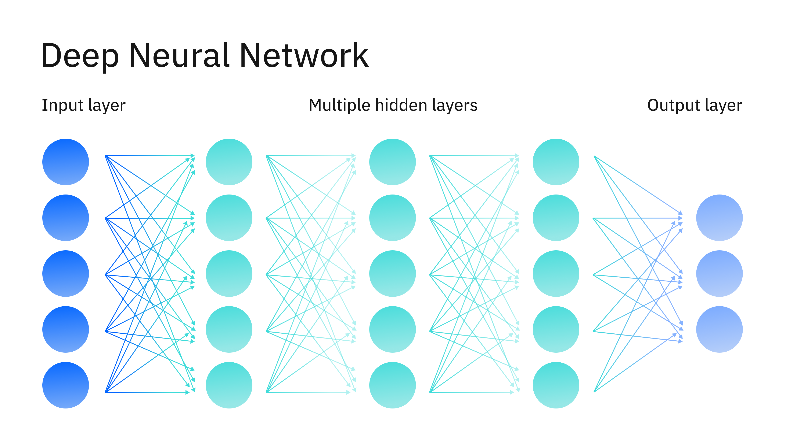

МІНІСТЕРСТВО ОСВІТИ І НАУКИ УКРАЇНИ

НАЦІОНАЛЬНИЙ УНІВЕРСИТЕТ "ЛЬВІВСЬКА ПОЛІТЕХНІКА"

 
 
 
 

# 
ЛЕКЦІЯ 1. ВВЕДЕННЯ В КУРС "ШТУЧНИЙ ІНТЕЛЕКТ В ІГРОВИХ ЗАСТОСУНКАХ"

 
 

### 
Львів -- 2025

# Лекція зі штучного інтелекту 2025-01

## Вступ

Ласкаво просимо до серії лекцій зі штучного інтелекту 2025 року. На цьому занятті ми розглянемо основи штучного інтелекту, його історичний шлях та широкий спектр застосувань.

## Теми, що розглядаються

1. Розуміння штучного інтелекту
2. Історія ШІ
3. Застосування ШІ 
4. Майбутнє ШІ
5. Етичні питання та виклики
6. Вплив ШІ на суспільство
7. Технологічні тренди та інновації

## Розуміння штучного інтелекту

На концептуальному рівні штучний інтелект (ШІ) -- дісципліна прикладної математики і програмування, яка передбачає створення систем, здатних виконувати завдання, які зазвичай вимагають людського інтелекту. Ці системи розроблені для відтворення людських можливостей, таких як візуальне сприйняття, розпізнавання мови, прийняття рішень та переклад мов.

На технічному рівні ШІ -- це набір методів розв'язання задач, для яких невідомі точні алгоритми, але є дані, через які рішення можна знайти.

## Техніки ШІ

Математично, задачі ШІ -- це задачі оптимізації, які можна розв'язати за допомогою різних методів. Ці методи сформували великі галузі ШІ, які вирішують різні задачі.

### Статистичні і логічні методи

До класичних методів відносяться методи пошука в просторі станів (різновид статистичного методу), локальний пошук, тобто, по суті класичні методи розв'язання задач оптимізації.

Алгоритми кластеризації, методи дерева рішень, методи машини підтримуючих векторів (SVM) -- також методи розв'язання задачі класифікації або кластеризації.

### Нейронні мережі і глибоке навчання

Нейронні мережі є класом чисельних моделей. Нейронні мережі використовують навчання на прикладах для побудови моделей, які можуть бути використані для вирішення задач класифікації, регресії та інших завдань.

Архітектура нейронних мереж, що використовуються сьогодні, була запропонована ще у 1943 році, але практично без змін застосовується набір частин мережі, описаний Румельхартом та Мак-Каллоком в 1986 році:

* Набір обробних одиниць
* Стан активації
* Функція виходу для кожної одиниці
* Схема з'єднаності між одиницями
* Правило поширення для поширення шаблонів активності через мережу з'єднань
* Правило активації для поєднання вхідних даних, що впливають на одиницю, з поточним станом цієї одиниці для створення виходу для одиниці
* Правило навчання, за яким шаблони з'єднаності змінюються в результаті досвіду
* Середовище, в якому система повинна працювати

### Віхи в історії ШІ

- **1950-ті**: Поява перших програм для гри в шахи.
- **1980-ті**: Експертні системи та їх застосування.
- **2000-ті**: Розвиток машинного навчання та великих даних.

## Застосування ШІ

ШІ застосовується у багатьох галузях, включаючи:

- Охорона здоров'я: ШІ допомагає діагностувати захворювання, персоналізувати плани лікування та прогнозувати результати пацієнтів.
- Фінанси: ШІ використовується для виявлення шахрайства, алгоритмічної торгівлі та управління ризиками.
- Транспорт: ШІ відіграє вирішальну роль в автономних транспортних засобах, управлінні трафіком та оптимізації маршрутів.
- Розваги: ШІ покращує відеоігри, пропонує фільми та підтримує створення контенту.

## Приклади методів ШІ

Розглянемо задачу розпізнавання зображень. Припустимо, що нам необхідно отримати описання лінії в двомерній системі координат. Лінія може бути описана рівнянням $y = ax + b$, але якщо у нас нема можливості отримати точні значення $a$ та $b$ аналітичним шляхом, то ми можемо застосувати різні методи статистичного аналізу, продвигаючись в сторону класичних методів ШІ відповідно до наявних вихідних даних.

### Статистичний метод: лінійна регресія

Якщо лінія описана, наприклад, хмарою точок $(x_i, y_i)$, то ми можемо застосувати метод найменших квадратів для знаходження коефіцієнтів $a$ та $b$. Ця техніка є класичною задачею статистичного аналізу, яка є базовою для багатьох методів ШІ. Методом її вирішення може бути так звана лінійна регресія.

### Машинне навчання: отримання feature-vector методами комп'ютерного зору

У випадку, якщо лінія задана растровими даними на двомерному масиві (напрклад, на зображенні або фотографії), то ми можемо застосувати методи комп'ютерного зору для отримання feature-vector, який буде описувати лінію.

### Машинне навчання: нейронні мережі

Припустимо, що лінія задана на зображенні, яке ми можемо представити у вигляді двовимірного масиву, і що нам треба класифікувати зображення, наприклад лінія репрезентує конкретну цифру.

Це типова задача класифікації, яка може бути вирішена за допомогою нейронних мереж. Нейронні мережі є одним з найпопулярних методів ШІ, який використовується для вирішення задач класифікації, регресії та інших завдань.

Вхідними даними для нейронної мережі (а саме тришарового перцептрона, який ми розглянемо) є зображення, а вихідними -- класифікація. Нейронна мережа складається з багатьох шарів, кожен з яких виконує певну функцію.

Вхідні дані представляються у вигляді вектора, кожен елемент якого є одним з пікселів зображення. Вихідні дані представляються у вигляді вектора, кожен елемент якого є одним з класів.

Модель нейронної мережі може бути представлена у вигляді графу, в якому кожна вершина є одним з елементів мережі, а кожне ребро є зв'язком між двома елементами.

Модель використовується в різних режимах при її створенні: навчання, тестування, передбачення.

При навчанні метод backpropagation оновлює і оптимізує параметри моделі, а при тестуванні -- перевіряє її точність.

Стадія використання моделі -- це стадія передбачення, коли модель використовується для передбачення результату на нових даних, тобто розв'язання задачі класифікації.

## Висновок

Ця лекція охопила основи штучного інтелекту, його задачі та застосування. Ми розглянули основні техніки ШІ та їх застосування, а також теми, які ми будемо розглядати в наступних лекціях. Ми також розглянули принципи роботи одного з найпопулярних методів ШІ -- нейронних мереж.
