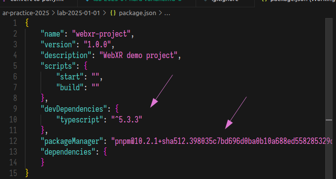
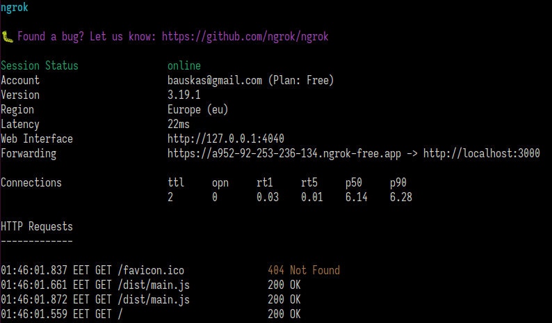
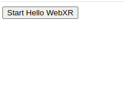

<div style="text-align: center;">

МІНІСТЕРСТВО ОСВІТИ І НАУКИ УКРАЇНИ

НАЦІОНАЛЬНИЙ УНІВЕРСИТЕТ "ЛЬВІВСЬКА ПОЛІТЕХНІКА"

КАФЕДРА ПРОГРАМНОЇ ІНЖЕНЕРІЇ

</div>

<br/>
<br/>
<br/>
<br/>

# <p style="text-align: center;">ОРГАНІЗАЦІЯ СЕРЕДОВИЩА РОЗРОБКИ ЗАСТОСУНКІВ ВІРТУАЛЬНОЇ РЕАЛЬНОСТІ З ВИКОРИСТАННЯМ ВЕБ API WEBXR</p>

<br/>
<br/>

## <p style="text-align: center;">МЕТОДИЧНІ ВКАЗІВКИ</p>
### <p style="text-align: center;">до виконаннялабораторної роботи № 1 з дисципліни «Віртуальна реальність»<br/>для студентів першого (бакалаврського) рівня вищої освіти спеціальності 121 “Інженерія програмного забезпечення”</p>
<br/>
<br/>
<br/>
<br/>
<br/>
<br/>
<br/>
<br/>
<br/>
<br/>
<br/>
<br/>
<br/>
<br/>

### <p style="text-align: center;">Львів -- 2025</p>

<div style="page-break-after: always;"></div>

**Організація середовища розробки застосунків віртуальної реальності з використанням веб API WebXR**: методичні вказівки до виконання лабораторної роботи №1 з дисципліни "Віртуальна реальність" для студентів першого (бакалаврського) рівня вищої освіти спеціальності 121 "Інженерія програмного забезпечення" . Укл.: О.Є. Бауск. -- Львів: Видавництво Національного університету "Львівська політехніка", 2025. -- 12 с.
<br/>
<br/>
<br/>
<br/>

&nbsp;&nbsp;&nbsp;&nbsp;&nbsp;&nbsp;**Укладач**: Бауск О.Є., к.т.н., асистент кафедри ПЗ

<br/>
<br/>

&nbsp;&nbsp;&nbsp;&nbsp;&nbsp;&nbsp;**Відповідальний за випуск**: Федасюк Д.В., доктор техн. наук, професор

<br/>
<br/>

&nbsp;&nbsp;&nbsp;&nbsp;&nbsp;&nbsp;**Рецензенти**: Федасюк Д.В., доктор техн. наук, професор

&nbsp;&nbsp;&nbsp;&nbsp;&nbsp;&nbsp;&nbsp;&nbsp;&nbsp;&nbsp;&nbsp;&nbsp;&nbsp;&nbsp;&nbsp;&nbsp;&nbsp;&nbsp;&nbsp;&nbsp;&nbsp;&nbsp;&nbsp;&nbsp;&nbsp;&nbsp;&nbsp;&nbsp;&nbsp;&nbsp; Задорожній І.М., асистент кафедри ПЗ


<div style="page-break-after: always;"></div>

# Лабораторна робота  №1

## Тема
Основи роботи з XebXR -- API доповненої реальністі на веб платформі.

## Мета роботи
Налаштувати середовище розробки для роботи з веб API доповненої реальністі, ознайомитись з інструментами веб-розробки, Typescript, Three.js, WebXR API, імплементувати створення простого 3D об'єкту в WebXR, налаштувати remote debugging для мобільного пристрою.

## Завдання до лабораторної роботи №1

1. Налаштувати середовище розробки Cursor та інструменти для роботи з Node.js (NVM, PNPM).

2. Встановити та налаштувати ngrok для створення HTTPS ендпойнту.

3. Створити базовий веб-проект з використанням Three.js та WebXR API.

4. Імплементувати відображення простого 3D об'єкту в середовищі доповненої реальності.

5. Дослідити базові методи і функції WebXR API.

6. Налаштувати remote debugging для тестування на мобільному пристрої.


## Теоретичні відомості
WebXR є веб-стандартом, який надає API для створення віртуальної (VR) та доповненої (AR) реальності у веб-браузерах. Цей інтерфейс дозволяє розробникам створювати імерсивний контент, доступний через веб-браузер без необхідності встановлення додаткових додатків.

### Основні компоненти WebXR

1. **WebXR Device API**
   - Забезпечує доступ до VR/AR пристроїв
   - Керує сесіями та просторовим відстеженням
   - Обробляє введення від контролерів

2. **Three.js інтеграція**
   - Популярна JavaScript бібліотека для 3D графіки
   - Спрощує створення та рендеринг 3D об'єктів
   - Надає готові компоненти для роботи з WebXR

### Технічні вимоги

1. **Для розробки:**
   - Сучасний веб-браузер з підтримкою WebXR
   - Node.js та пакетний менеджер (npm/pnpm)
   - Інструменти збірки (наприклад, esbuild)
   - HTTPS з'єднання (необхідне для WebXR)

2. **Для мобільних пристроїв:**
   - Android 8.0 або новіше
   - ARCore-сумісний пристрій
   - Chrome 79+ або інший сумісний браузер

### WebXR та ARCore

WebXR Device API ([MDN Documentation](https://developer.mozilla.org/en-US/docs/Web/API/WebXR_Device_API)) надає стандартизований інтерфейс для доступу до VR та AR функціональності через веб-браузер. На Android пристроях WebXR працює поверх ARCore ([Google ARCore Documentation](https://developers.google.com/ar)) - платформи Google для створення AR досвіду.

ARCore забезпечує основні можливості, необхідні для AR:
- Відстеження руху (motion tracking) - дозволяє телефону розуміти своє положення відносно світу
- Розуміння навколишнього середовища (environmental understanding) - виявлення розміру та розташування поверхонь
- Оцінка освітлення (light estimation) - дозволяє правильно освітлювати віртуальні об'єкти

WebXR використовує ці можливості ARCore через абстрактний шар, що дозволяє писати крос-платформний код. Коли ви використовуєте WebXR API на Android пристрої, браузер автоматично взаємодіє з ARCore для забезпечення AR функціональності.

### Особливості розробки з WebXR

При розробці WebXR додатків важливо враховувати:

1. **Безпека та дозволи**
   - WebXR вимагає HTTPS з'єднання
   - Користувач повинен явно надати дозвіл на доступ до камери
   - Сесія AR починається тільки після взаємодії користувача (наприклад, натискання кнопки)

2. **Життєвий цикл AR сесії**
   - Перевірка підтримки AR функціональності
   - Ініціалізація сесії
   - Обробка подій входу/виходу з сесії
   - Коректне завершення сесії

3. **Оптимізація продуктивності**
   - Мінімізація використання ресурсів
   - Ефективне управління 3D об'єктами
   - Правильна обробка втрати відстеження

Детальніше про розробку можна дізнатись у:
- [WebXR Samples](https://immersive-web.github.io/webxr-samples/)
- [Google ARCore WebXR](https://developers.google.com/ar/develop/webxr/hello-webxr#run_hello_webxr)
- [Three.js WebXR Documentation](https://threejs.org/docs/?q=webxr#api/en/renderers/webxr/WebXRManager)


## Хід роботи

### 1. Необхідні інструменти розробки

1.1. Установити середовище розробки Cursor: [https://www.cursor.com/](https://www.cursor.com/)

1.2. Для управління версіями Node.js -- Установити NVM: [https://github.com/nvm-sh/nvm](https://github.com/nvm-sh/nvm)

1.2.1 Версія Node.js для виконання лабораторних робіт - LTS 22.13.1.

1.2.2 У випадку проблеми зі зміною версії Node.js за допомогою NVM, наприклад неможливості перейти з system на LTS, реініцалізацію можна виконати наступним чином:

```bash
nvm deactivate && nvm unload && source ~/.nvm/nvm.sh && nvm use --lts
```

1.3. Установити Node.js, останню LTS версію, за допомогою NVM.

```bash
nvm install --lts
nvm use --lts
```

1.4. Для управління Node.js залежностями в проекті -- Установити PNPM: [https://www.npmjs.com/get-npm](https://www.npmjs.com/get-npm)

1.4.1. Варіант 1. Викорстовувати corepack для встановлення PNPM.
```bash
npm install --global corepack@latest
corepack enable pnpm
```

1.4.2. Варіант 2. Викорстовувати npm для встановлення PNPM.
```bash
npm install -g pnpm
```

1.5. Для створення HTTPS ендпойнту онлайн -- зареєструватись в сервісі ngrok та встановити ngrok CLI: [https://ngrok.com/](https://ngrok.com/)

```bash
curl -sSL https://ngrok-agent.s3.amazonaws.com/ngrok.asc \
	| sudo tee /etc/apt/trusted.gpg.d/ngrok.asc >/dev/null \
	&& echo "deb https://ngrok-agent.s3.amazonaws.com buster main" \
	| sudo tee /etc/apt/sources.list.d/ngrok.list \
	&& sudo apt update \
	&& sudo apt install ngrok

ngrok config add-authtoken <YOUR_AUTH_TOKEN>
# Test ngrok
ngrok http localhost:3000
```

1.6 Склонувати локально цей репозиторій і відкрити в Cursor перше завдання ЛР-01-01 `ar-practice-2025/lab-2025-01-01`.

### 2. Нотатки до виконання.

2.1. NVM - Node Version Manager, підсистема для управління версіями Node.js. NVM необхідно для того, щоб можна було легко перемикатися між різними версіями Node.js. В рамках цього та інших курсів та лабораторних робіт може виникнути потреба мати доступ до різних версій Node.js. NVM дозволяє легко перемикатися між різними версіями рантайму. Наша робоча версія Node.js в рамках цього курсу - LTS 22.13.1.

2.2. PNPM - це аналог npm, ефективний пакет-менеджер, який використовується для управління залежностями в проектах. PNPM є альтернативою npm, яка має більш швидкі та ефективні алгоритми для керування залежностями. За бажанням можна використовувати інші пакет-менеджери, такі як Yarn, npm, vite тощо, але методичні вказівки та завдання будуть розроблені з урахуванням PNPM.

2.3. Cursor - це IDE, яка інтегрує VSCode та AI, і дозволяє використовувати промпти штучного інтелекту для написання коду. Cursor є альтернативою VSCode, методичні вказівки не роблять особливих вимог до використання Cursor, але він може бути корисним для написання коду. Як альтернатива може використовуватись VSCode.

### 3. Виконання завдання.

#### 3.1. Відкрити в Cursor проект `ar-practice-2025/lab-2025-01-01`.
**Ця директорія має бути робочою для наступних команд, якщо не вказано інше.**

#### 3.2. Переконатись, що версії інструментів встановлені і відповідають очікуваним. В терміналі виконати команди:

```bash
# Node.js
node --version
# v22.13.1
# У випадку проблеми з версією:
nvm install --lts
nvm use --lts

# PNPM
pnpm --version
# v10.2.1
# У випадку проблеми з версією:
corepack enable pnpm
corepack use pnpm@latest-10
```

#### 3.3. Команди в п 3.2. прописують в файлі конфігурації проекта (`package.json`) версію пакетного менеджера (ми використовуємо PNPM).

Також в файлі конфігурації прописані всі залежності, які потрібно встановити для розробки проекту. Залежності встановлюються командою `pnpm install`. Існують залежності часу виконання, які потрібні для production версії проекту, тобто для виконання коду проекту, і залежності часу розробки, які потрібні тільки для розробки проекту. Приклад залежностей часу розробки -- це Typescript компілятор, який транслює код з Typescript в JavaScript що виконуєтьяс в браузері (і тому Typescript не потрібний для виконання коду проекту), і декларації типів для TypeScript, які потрібні для правильної компіляції коду і також не використовуються в готовому скомпільованому коді.

Слід відкрити файл `package.json` і переконатись, що corepack коректно встановив `"packageManager"` та що ми маємо в залежностях часу розробки правильну версію TypeScript `"devDependencies"->"typescript"`:



#### 3.4. Відкрити файл `main.ts` і переконатись, що він не містить помилок.

3.4.1. Перша помилка, яку ви маєте побачити -- це помилка з імпортом Three.js:


Вирішить проблеми з імпортом і типізацією Three.js та WebXR API. Встановіть наступні залежності:

```bash
pnpm install three@0.172.0
pnpm install -D @types/three@0.172.0
pnpm install -D @types/webxr
```

#### 3.5. Встановити залежності для запуску проекту.

В роботі використовуються наступні команди, які треба запускати в терміналі,
знаходячись в робочій директорії проекту, `ar-practice-2025/lab-2025-01-01`.

Зараз вони наведені тут просто для ознайомлення, запускати їх не потрібно.

```bash
pnpm run start # запуск проекту для розробки з перебудуванням при зміні файлів
pnpm run build # білд проекту
```

Необхідно інсталювати залежності `esbuild` та `serve` для того, щоб робити білд проекту та запустити локальний сервер для розробки та відлагодження:

``` bash
pnpm install -D esbuild serve
```

Перевірте, чи працює команда `pnpm run start`. Успішне виконання команди має відкрити локальний сервер на порту 3000.

* Увага! Команди треба виконувати в терміналі, знаходячись в робочій директорії проекту, `ar-practice-2025/lab-2025-01-01`. *

```bash
pnpm run start
```

Успішне виконання команди має відкрити локальний сервер на порту 3000. Оскільки проект ще треба імплементувати, команда може не працювати і видати помилку, на цьому кроці це нормально.


#### 3.6. Використати ngrok для створення HTTPS ендпойнту, доступного з мобільного пристрою.

```bash
ngrok http http://localhost:3000
```

Команда повинна відкрити ендпойнт, який можна буде використовувати для доступу до проекту з мобільного пристрою.



На скріншоті вище показано, що ngrok відкрив ендпойнт (строка `https://a952-92-253-236-134.ngrok-free.app` після слова `Forwarding`). Скопіюйте цю строку в браузер. Зараз проект ще не в робочому стані, але після виконання роботи за цією адресою буде доступний доступ до працюючого локально сервера з вашого мобільного пристрою.

#### 3.7. Відкрити ендпойнт в браузері на мобільному пристрої

3.7.1 Відкрити отриманий вище від ngrok HTTPS ендпойнт в браузері на мобільному пристрої і переконатись, що він відкривається.


Зараз, оскільки проект ще не в робочому стані, треба просто переконатись що сторінка як на скріншоті вище відкривається.

#### 3.8. Імплементувати створення простого 3D об'єкту в WebXR.

3.8.1. Дослідіть приклад створення простого 3D об'єкту в WebXR в документації.
Задача Лабораторної роботи -- відтворити приклад з документації до розділу "Run Hello WebXR", на який подано посилання нижче.

[https://developers.google.com/ar/develop/webxr/hello-webxr#run_hello_webxr](https://developers.google.com/ar/develop/webxr/hello-webxr#run_hello_webxr)

3.8.2. Відкрийте файл `main.ts`, дослідіть існуючий код. Це непрацюючий шаблон  коду, який треба наповнити імплементацією відповідно до прикладу вище. Зверніть увагу на наступні речі:

* Структура коду інша, ніж у прикладі. Проаналізуйте приклад крок за кроком і використайте відповідні фрагменти в main.ts там, де це потрібно.

* Ваш код використовує Typescript, код з документації потрібно оздобити відповідними типами.

3.8.3. Імплементуйте код відповідно до прикладу з документації.

3.8.3.1. Знайдіть в коді `main.ts` наступний фрагмент коду:

```ts
// FIX THIS:
const scene = null;
```

Імплементуйте правильну ініціалізацію сцени (є в документації по посиланню вище).
Поміняйте код вище на наступний:

```ts
const scene = new THREE.Scene();
```

3.8.3.2. Знайдіть в коді `main.ts` наступний фрагмент коду:

```ts
// FIX THIS:
const camera = null;
```

Імплементуйте правильну ініціалізацію камери (є в документації по посиланню вище). Поміняйте код вище на наступний:

```ts
const camera = new THREE.PerspectiveCamera();
```

3.8.3.3. Знайдіть в коді `main.ts` наступний фрагмент коду:

```ts
// FIX THIS:
const baseLayer = null;
```

Імплементуйте правильну ініціалізацію базового шару (є в документації по посиланню вище). Поміняйте код вище на наступний:

```ts
const baseLayer = new XRWebGLLayer(session, gl);
```

3.8.3.4. Знайдіть в коді `main.ts` наступний фрагмент коду:

```ts
// request reference space
referenceSpace = null;
```

Імплементуйте правильну ініціалізацію простору (є в документації по посиланню вище). Поміняйте код вище на наступний:

```ts
referenceSpace = await session.requestReferenceSpace(spaceType);
```

3.9. Запустіть проект і переконайтесь, що він працює.

3.9.1. Виконайте команду побудови проекту для розробки:

```bash
pnpm run start
```

Перевірте, чи запустився локальний сервер на порту 3000, як на скріншоті нижче.


3.9.2. Якщо ngrok не запустився, запустіть його командою з пункту 3.6.

3.9.3. Відкрийте ендпойнт в браузері на мобільному пристрої і переконайтесь, що він відкривається.


Нажміть "Visit Site" і переконайтесь, що відкривається сторінка з проектом.

3.9.4. У вас має відкритися сторінка проекту:



Нажміть кнопку "Start Hello WebXR", надайте всі необхідні дозволи для доступу до камери і т.д.

Ви маєте побачити відео з камери телефону. Покрутіть телефоном і знайдіть в просторі 3D об'єкт, який був створений в коді. Дослідіть, як він відображається в просторі.


## Зміст звіту

1. Тема та мета роботи.
2. Теоретичні відомості.
3. Постановка завдання.
4. Хід виконання, який включатиме скріншоти процесу білду та запуску проекту,
скріншоти імплементації 3D сцени відповідно до прикладу з документації.
5. Результати виконання у вигляді скріншотів з мобільного пристрою.
6. Висновки.

## Контрольні питання

1. Що таке WebXR API?

2. Які основні компоненти необхідні для розробки WebXR додатків?

3. Як налаштувати середовище розробки для WebXR?

4. Що таке remote debugging і для чого він використовується в контексті WebXR?

5. Які інструменти потрібні для тестування WebXR додатків на мобільних пристроях?

6. Яка роль ngrok у розробці веб-додатків для мобільних пристроїв?

7. Які основні етапи створення простого 3D об'єкту в WebXR?

8. Як працює Three.js з WebXR API?

9. Опишіть свій досвід з використанням TypeScript в лабораторній роботі.

10. Які вимоги до мобільних пристроїв для роботи з WebXR?

11. Що таке AR сесія в контексті WebXR і як вона ініціалізується?

13. Як забезпечити кросбраузерну підтримку WebXR додатків?

14. Які інструменти для збірки проекту використовуються в даній лабораторній роботі?

15. Які основні проблеми можуть виникнути при розробці WebXR додатків та як їх вирішувати?

16. Як оптимізувати продуктивність WebXR додатків?
